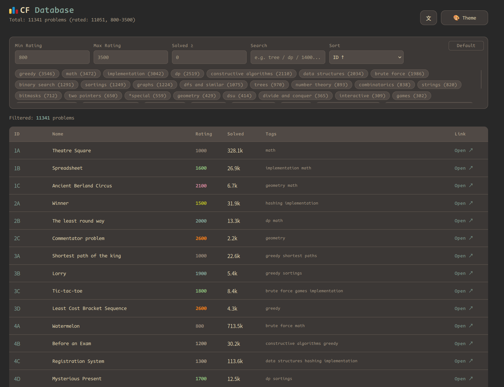

#  Codeforces Database (cfdb)

**English** · [中文](README.zh-CN.md)



A fully-local Codeforces problem database with a built-in web UI. Browse **11k+ problems**, read statements and editorials offline — no CDN, no account, works on your LAN.

## Features

- **Full problem metadata** — 11k+ problems from the Codeforces API (rating 800–3500, tags, solved counts) → `problems.json`
- **Statements & editorials, fully localized** — crawled as Markdown into `statements/` and `editorials/`; images included; formulas rendered by local MathJax (SVG, offline)
- **Dynamic per-problem tutorials** — new-style editorials (2024+) that load via JS are completed through the `problemTutorial` API
- **PDF statements** — contests with no HTML statement (old ACM rounds) are extracted via `pdftotext`
- **Crawl intelligence** — incremental crawling with failure memory (`failed_statements.json` / `failed_editorials.json`), fake-editorial guard (403 pages / placeholder residue never written), 403/rate-limit awareness, batched concurrent fetching (8 workers)
- **Local web UI** (`index.html`, single file):
  - Filter by rating / solved count / tags / name; 6 sort modes incl. ID desc
  - Detail view with **Statement / Editorial** tabs; problem titles link to the original problem; "Open ↗" link
  - **Collapsible sections** (Hint / Solution / Tutorial / …) — borderless, theme-aware
  - **One-click copy buttons** on samples & code blocks (Nerd Font icon, works in every browser)
  - **MathJax rendering** with a four-layer protection chain for raw LaTeX
  - **i18n**: English by default, Chinese via the 「文/En」 button — layout stays pixel-stable across languages
  - **Two themes**: Catppuccin Mocha / Gruvbox Dark (CSS variables, gruvbox by default)
  - Your own solutions shown under each statement (`solutions/{id}.ext`)
- **Zero CDN** — marked, highlight.js, MathJax and the CodeNewRoman Nerd Font are all vendored locally
- **LAN ready** — binds `0.0.0.0` by default, no auth

## Quick Start

```bash
# Code only (no data) — data lives on the `snapshot` branch
git clone https://github.com/xyt-dev/cfdb.git
cd cfdb
python3 server.py          # start server (auto incremental crawl on startup)

# With full data snapshot (statements/editorials/images, tagged snapshot2026.8):
git clone -b snapshot https://github.com/xyt-dev/cfdb.git
```

Then open <http://localhost:8765> (LAN address is printed on startup).

**Dependencies**: Python 3.10+, `curl`, `poppler-utils` (`pdftotext`, only for PDF statements). All web assets are already in `vendor/` — no npm, no pip install.

Port override: `CFDB_PORT=9000 python3 server.py`

## Manual Crawl / Update

```bash
python3 update.py               # refresh metadata (problems.json)
python3 update.py --statements  # pre-crawl all statements
python3 update.py --editorials  # pre-crawl all editorials
```

## Data Layout

```text
cfdb/
├── problems.json          # metadata (git-ignored, regenerable)
├── statements/            # statement md + images/ (git-ignored)
├── editorials/            # editorial md + images/ (git-ignored)
├── solutions/             # your own solutions, {id}.{ext}
├── server.py              # HTTP server + auto incremental crawler
├── cfcrawl.py             # crawl library (curl anti-anti-bot, md generation)
├── html2md.py             # HTML → Markdown converter
├── update.py              # data refresh / full pre-crawl
├── index.html             # single-file frontend
├── vendor/                # local deps: marked, highlight.js, MathJax, Nerd Font
├── CHANGELOG.md
└── failed_statements.json / failed_editorials.json   # crawl failure memory
```

## Notes

- If Codeforces temporarily bans your IP (all requests return 403), local data stays fully usable; the server skips crawling and retries on next start.
- Git only tracks code; data (`statements/`, `editorials/`, `problems.json`, failure memories) is git-ignored.
- See [CHANGELOG.md](CHANGELOG.md) for the full history.
