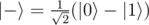

# A. Generate plus state or minus state

**time limit per test:** 1 second

**memory limit per test:** 256 megabytes

**input:** standard input

**output:** standard output

You are given a qubit in state


 and an integer *sign*.

Your task is to convert the given qubit to state


 if *sign* = 1 or



 if *sign* =  - 1.

#### Input

You have to implement an operation which takes a qubit and an integer as an input and has no output. The "output" of your solution is the state in which it left the input qubit.

Your code should have the following signature:
```cpp
namespace Solution {
 open Microsoft.Quantum.Primitive;
 open Microsoft.Quantum.Canon;

 operation Solve (q : Qubit, sign : Int) : ()
 {
 body
 {
 // your code here
 }
 }
}
```
