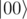
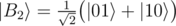
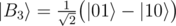

# B. Generate Bell state

**time limit per test:** 1 second

**memory limit per test:** 256 megabytes

**input:** standard input

**output:** standard output

You are given two qubits in state



 and an integer *index*. Your task is to create one of the [Bell states](<https://en.wikipedia.org/wiki/Bell_state>) on them according to the *index*:

-


-


-



-



#### Input

You have to implement an operation which takes an array of 2 qubits and an integer as an input and has no output. The "output" of your solution is the state in which it left the input qubits.

Your code should have the following signature:
```cpp
namespace Solution {
 open Microsoft.Quantum.Primitive;
 open Microsoft.Quantum.Canon;

 operation Solve (qs : Qubit[], index : Int) : ()
 {
 body
 {
 // your code here
 }
 }
}
```
