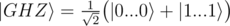
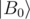

# C. Generate GHZ state

**time limit per test:** 1 second

**memory limit per test:** 256 megabytes

**input:** standard input

**output:** standard output

You are given *N* qubits (1 ≤ *N* ≤ 8) in zero state


. Your task is to create Greenberger–Horne–Zeilinger (GHZ) state on them:



Note that for *N* = 1 and *N* = 2 GHZ state becomes states


 and



 from the previous tasks, respectively.

#### Input

You have to implement an operation which takes an array of *N* qubits as an input and has no output. The "output" of your solution is the state in which it left the input qubits.

Your code should have the following signature:
```cpp
namespace Solution {
 open Microsoft.Quantum.Primitive;
 open Microsoft.Quantum.Canon;

 operation Solve (qs : Qubit[]) : ()
 {
 body
 {
 // your code here
 }
 }
}
```
