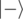

# D. Distinguish plus state and minus state

**time limit per test:** 1 second

**memory limit per test:** 256 megabytes

**input:** standard input

**output:** standard output

You are given a qubit which is guaranteed to be either in


 or in


 state.

Your task is to perform necessary operations and measurements to figure out which state it was and to return 1 if it was a


 state or -1 if it was



 state. The state of the qubit after the operations does not matter.

#### Input

You have to implement an operation which takes a qubit as an input and returns an integer.

Your code should have the following signature:
```
namespace Solution {
    open Microsoft.Quantum.Primitive;
    open Microsoft.Quantum.Canon;

    operation Solve (q : Qubit) : Int
    {
        body
        {
            // your code here
        }
    }
}
```
