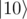

# F. Distinguish multi-qubit basis states

**time limit per test:** 1 second

**memory limit per test:** 256 megabytes

**input:** standard input

**output:** standard output

You are given *N* qubits which are guaranteed to be in one of two basis states on *N* qubits. You are also given two bitstrings *bits*0 and *bits*1 which describe these basis states.

Your task is to perform necessary operations and measurements to figure out which state it was and to return 0 if it was the state described with *bits*0 or 1 if it was the state described with *bits*1. The state of the qubits after the operations does not matter.

#### Input

You have to implement an operation which takes the following inputs:

- an array of qubits *qs*,
- two arrays of boolean values *bits*0 and *bits*1, representing the basis states in which the qubits can be. These arrays will have the same length as the array of qubits. *bits*0 and *bits*1 will differ in at least one position.

An array of boolean values represents a basis state as follows: the *i*-th element of the array is true if the *i*-th qubit is in state


, and false if it is in state


. For example, array [true; false] describes 2-qubit state



.

Your code should have the following signature:
```
namespace Solution {
    open Microsoft.Quantum.Primitive;
    open Microsoft.Quantum.Canon;

    operation Solve (qs : Qubit[], bits0 : Bool[], bits1 : Bool[]) : Int
    {
        body
        {
            // your code here
        }
    }
}
```
