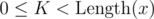

# G. Oracle for f(x) = k-th element of x

**time limit per test:** 1 second

**memory limit per test:** 256 megabytes

**input:** standard input

**output:** standard output

Implement a quantum oracle on *N* qubits which implements a function *f*(*x*) = *x*~*k*~, i.e. the value of the function is the value of the *k*-th qubit.

For an explanation on how the quantum oracles work, see [the tutorial blog post](<https://codeforces.com/blog/entry/60319>).

#### Input

You have to implement an operation which takes the following inputs:

- an array of qubits *x* (input register),
- a qubit *y* (output qubit),
- 0-based index of the qubit from input register *K* (



).

The operation doesn't have an output; the "output" of your solution is the state in which it left the qubits.

Your code should have the following signature:
```cpp
namespace Solution {
 open Microsoft.Quantum.Primitive;
 open Microsoft.Quantum.Canon;

 operation Solve (x : Qubit[], y : Qubit, k : Int) : ()
 {
 body
 {
 // your code here
 }
 }
}
```
