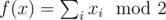

# H. Oracle for f(x) = parity of the number of 1s in x

**time limit per test:** 1 second

**memory limit per test:** 256 megabytes

**input:** standard input

**output:** standard output

Implement a quantum oracle on *N* qubits which implements the following function:



, i.e., the value of the function is 1 if *x* has odd number of 1s, and 0 otherwise.

#### Input

You have to implement an operation which takes the following inputs:

- an array of qubits *x* (input register),
- a qubit *y* (output qubit).

The operation doesn't have an output; the "output" of your solution is the state in which it left the qubits.

Your code should have the following signature:
```cpp
namespace Solution {
 open Microsoft.Quantum.Primitive;
 open Microsoft.Quantum.Canon;

 operation Solve (x : Qubit[], y : Qubit) : ()
 {
 body
 {
 // your code here
 }
 }
}
```
