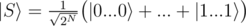
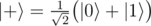
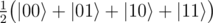

# A1. Generate superposition of all basis states

**time limit per test:** 1 second

**memory limit per test:** 256 megabytes

**input:** standard input

**output:** standard output

You are given *N* qubits (1 ≤ *N* ≤ 8) in zero state


.

Your task is to generate an equal superposition of all 2^*N*^ basis vectors on *N* qubits:



For example,

- for *N* = 1, the required state is simply



,
- for *N* = 2, the required state is



.

You have to implement an operation which takes an array of *N* qubits as an input and has no output. The "output" of the operation is the state in which it leaves the qubits.

Your code should have the following signature:
```cpp
namespace Solution {
 open Microsoft.Quantum.Primitive;
 open Microsoft.Quantum.Canon;

 operation Solve (qs : Qubit[]) : ()
 {
 body
 {
 // your code here
 }
 }
}
```
