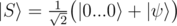
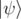
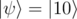
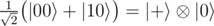

# A2. Generate superposition of zero state and a basis state

**time limit per test:** 1 second

**memory limit per test:** 256 megabytes

**input:** standard input

**output:** standard output

You are given *N* qubits (1 ≤ *N* ≤ 8) in zero state


. You are also given a bitstring *bits* which describes a non-zero basis state on *N* qubits


.

Your task is to generate a state which is an equal superposition of


 and the given basis state:



You have to implement an operation which takes the following inputs:

- an array of qubits *qs*,
- an arrays of boolean values *bits* representing the basis state



. This array will have the same length as the array of qubits. The first element of this array *bits*[0] will be true.

The operation doesn't have an output; its "output" is the state in which it leaves the qubits.

An array of boolean values represents a basis state as follows: the *i*-th element of the array is true if the *i*-th qubit is in state


, and false if it is in state


. For example, array [true; false] describes 2-qubit state



, and in this case the resulting state should be



.

Your code should have the following signature:
```cpp
namespace Solution {
 open Microsoft.Quantum.Primitive;
 open Microsoft.Quantum.Canon;

 operation Solve (qs : Qubit[], bits : Bool[]) : ()
 {
 body
 {
 // your code here
 }
 }
}
```
