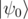
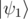
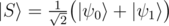

# A3. Generate superposition of two basis states

**time limit per test:** 1 second

**memory limit per test:** 256 megabytes

**input:** standard input

**output:** standard output

You are given *N* qubits (1 ≤ *N* ≤ 8) in zero state


. You are also given two bitstrings *bits*0 and *bits*1 which describe two different basis states on *N* qubits



 and



.

Your task is to generate a state which is an equal superposition of the given basis states:



You have to implement an operation which takes the following inputs:

- an array of qubits *qs*,
- two arrays of Boolean values *bits*0 and *bits*1 representing the basis states


 and


. These arrays will have the same length as the array of qubits. *bits*0 and *bits*1 will differ in at least one position.

The operation doesn't have an output; its "output" is the state in which it leaves the qubits.

Your code should have the following signature:
```cpp
namespace Solution {
 open Microsoft.Quantum.Primitive;
 open Microsoft.Quantum.Canon;

 operation Solve (qs : Qubit[], bits0 : Bool[], bits1 : Bool[]) : ()
 {
 body
 {
 // your code here
 }
 }
}
```
