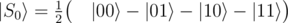
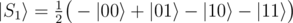
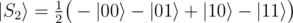
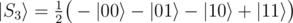
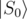
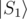

# B4. Distinguish four 2-qubit states - 2

**time limit per test:** 1 second

**memory limit per test:** 256 megabytes

**input:** standard input

**output:** standard output

You are given 2 qubits which are guaranteed to be in one of the four orthogonal states:

-



-



-



-



Your task is to perform necessary operations and measurements to figure out which state it was and to return the index of that state (0 for



, 1 for



 etc.). The state of the qubits after the operations does not matter.

You have to implement an operation which takes an array of 2 qubits as an input and returns an integer.

Your code should have the following signature:
```
namespace Solution {
    open Microsoft.Quantum.Primitive;
    open Microsoft.Quantum.Canon;

    operation Solve (qs : Qubit[]) : Int
    {
        body
        {
            // your code here
        }
    }
}
```
