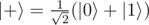
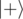

# C2. Distinguish zero state and plus state without errors

**time limit per test:** 2 seconds

**memory limit per test:** 256 megabytes

**input:** standard input

**output:** standard output

You are given a qubit which is guaranteed to be either in


 state or in



 state.

Your task is to perform necessary operations and measurements to figure out which state it was and to return 0 if it was a


 state, 1 if it was


 state or -1 if you can not decide, i.e., an "inconclusive" result. The state of the qubit after the operations does not matter.

Note that these states are not orthogonal, and thus can not be distinguished perfectly. In each test your solution will be called 10000 times, and your goals are:

- never give 0 or 1 answer incorrectly (i.e., never return 0 if input state was


 and never return 1 if input state was


),
- give -1 answer at most 80% of the times,
- correctly identify


 state at least 10% of the times,
- correctly identify


 state at least 10% of the times.

In each test


 and



 states will be provided with 50% probability.

You have to implement an operation which takes a qubit as an input and returns an integer.

Your code should have the following signature:
```
namespace Solution {
    open Microsoft.Quantum.Primitive;
    open Microsoft.Quantum.Canon;

    operation Solve (q : Qubit) : Int
    {
        body
        {
            // your code here
        }
    }
}
```
