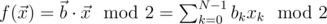
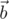

# D1. Oracle for f(x) = b * x mod 2

**time limit per test:** 1 second

**memory limit per test:** 256 megabytes

**input:** standard input

**output:** standard output

Implement a quantum oracle on *N* qubits which implements the following function:



, where


 (a vector of *N* integers, each of which can be 0 or 1).

For an explanation on how this type of quantum oracles works, see [Introduction to quantum oracles](<https://codeforces.com/blog/entry/60319>).

You have to implement an operation which takes the following inputs:

- an array of *N* qubits *x* in arbitrary state (input register), 1 ≤ *N* ≤ 8,
- a qubit *y* in arbitrary state (output qubit),
- an array of *N* integers *b*, representing the vector



. Each element of *b* will be 0 or 1.

The operation doesn't have an output; its "output" is the state in which it leaves the qubits.

Your code should have the following signature:
```cpp
namespace Solution {
 open Microsoft.Quantum.Primitive;
 open Microsoft.Quantum.Canon;

 operation Solve (x : Qubit[], y : Qubit, b : Int[]) : ()
 {
 body
 {
 // your code here
 }
 }
}
```
