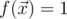
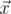

# D3. Oracle for majority function

**time limit per test:** 1 second

**memory limit per test:** 256 megabytes

**input:** standard input

**output:** standard output

Implement a quantum oracle on 3 qubits which implements a majority function. Majority function on 3-bit vectors is defined as follows:



 if vector



 has two or three 1s, and 0 if it has zero or one 1s.

For an explanation on how this type of quantum oracles works, see [Introduction to quantum oracles](<https://codeforces.com/blog/entry/60319>).

You have to implement an operation which takes the following inputs:

- an array of 3 qubits *x* in arbitrary state (input register),
- a qubit *y* in arbitrary state (output qubit).

The operation doesn't have an output; its "output" is the state in which it leaves the qubits.

Your code should have the following signature:
```cpp
namespace Solution {
 open Microsoft.Quantum.Primitive;
 open Microsoft.Quantum.Canon;

 operation Solve (x : Qubit[], y : Qubit) : ()
 {
 body
 {
 // your code here
 }
 }
}
```
