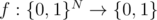
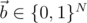

# E1. Bernstein-Vazirani algorithm

**time limit per test:** 2 seconds

**memory limit per test:** 256 megabytes

**input:** standard input

**output:** standard output

You are given a quantum oracle - an operation on *N* + 1 qubits which implements a function



. You are guaranteed that the function *f* implemented by the oracle is scalar product function (oracle from problem D1):


Here



 (an array of *N* integers, each of which can be 0 or 1).

Your task is to reconstruct the array


. Your code is allowed to call the given oracle only once.

You have to implement an operation which takes the following inputs:

- an integer *N* - the number of qubits in the oracle input (1 ≤ *N* ≤ 8),
- an oracle *Uf*, implemented as an operation with signature ((Qubit[], Qubit) => ()), i.e., an operation which takes as input an array of qubits and an output qubit and has no output.

The return of your operation is an array of integers of length *N*, each of them 0 or 1.

Your code should have the following signature:
```
namespace Solution {
    open Microsoft.Quantum.Primitive;
    open Microsoft.Quantum.Canon;

    operation Solve (N : Int, Uf : ((Qubit[], Qubit) => ())) : Int[]
    {
        body
        {
            // your code here
        }
    }
}
```
