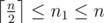

# A. Carpeting the Room

**time limit per test:** 2 seconds

**memory limit per test:** 64 megabytes

**input:** stdin

**output:** stdout

Soroush's room is a square with side length *n*. Before this contest he bought *k* fine Persian carpets to carpet his room for celebrating the 100th contest on his favorite site. Each Persian carpet is a square of side length *n*~1~.

Soroush wants to cover all the area of his room. Carpets can be put over each other but it is not allowed to rotate the carpets. Can Soroush carpet his room completely?

#### Input

The input consists of three integer numbers *n*, *k* and *n*~1~ (10 ≤ *n* ≤ 12, 1 ≤ *k* ≤ 10,



).

#### Output

Write a single YES or NO. Write YES if and only if Sorush can carpet his room completely.

#### Examples

#### Input
```
10 4 6
```

#### Output
```
YES
```

#### Input
```
10 2 5
```

#### Output
```
NO
```
