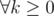

# E. Buying Sets

**time limit per test:** 2 seconds

**memory limit per test:** 256 megabytes

**input:** stdin

**output:** stdout

The Hexadecimal virus loves playing with number sets — intersecting them, uniting them. One beautiful day she was surprised to find out that Scuzzy, her spherical pet cat, united all sets in one and ate the result! Something had to be done quickly and Hexadecimal rushed to the market.

The market has *n* sets of numbers on sale. The virus wants to buy the following collection of sets: the number of sets in the collection should be exactly the same as the number of numbers in the union of all bought sets. Moreover, Hexadecimal wants to buy the cheapest suitable collection of set.

Yet nothing's so easy! As Mainframe is a kingdom of pure rivalry markets, we know that the union of any *k* sets contains no less than *k* distinct numbers (for every positive integer *k*).

Help the virus choose the suitable collection of sets. The collection can be empty.

#### Input

The first line contains the only number *n* (1 ≤ *n* ≤ 300) — the number of sets available in the market.

Next *n* lines describe the goods: first we are given *m*~*i*~ (1 ≤ *m*~*i*~ ≤ *n*) — the number of distinct numbers in the *i*-th set, then follow *m*~*i*~ numbers — the set's elements. We know that the set's elements are distinct positive integers and they do not exceed *n*.

The last line contains *n* integers whose absolute values do not exceed 10^6^ — the price of each set.

#### Output

Print a single number — the minimum price the virus will have to pay for such a collection of *k* sets that union of the collection's sets would have exactly *k* distinct numbers (



).

#### Examples

#### Input
```
3
1 1
2 2 3
1 3
10 20 -3
```

#### Output
```
-3
```

#### Input
```
5
2 1 2
2 2 3
2 3 4
2 4 5
2 5 1
1 -1 1 -1 1
```

#### Output
```
0
```

#### Input
```
5
2 1 2
2 2 3
2 3 4
2 4 5
2 5 1
-1 1 -1 1 -1
```

#### Output
```
-1
```
