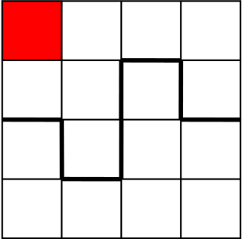

# B. Petya and Square

**time limit per test:** 2 seconds

**memory limit per test:** 256 megabytes

**input:** stdin

**output:** stdout

Little Petya loves playing with squares. Mum bought him a square 2*n* × 2*n* in size. Petya marked a cell inside the square and now he is solving the following task.

The task is to draw a broken line that would go along the grid lines and that would cut the square into two equal parts. The cutting line should not have any common points with the marked cell and the resulting two parts should be equal up to rotation.

Petya wants to determine whether it is possible to cut the square in the required manner given the sizes of the square side and the coordinates of the marked cell. Help him.

#### Input

The first line contains three space-separated integers 2*n*, *x* and *y* (2 ≤ 2*n* ≤ 100, 1 ≤ *x*, *y* ≤ 2*n*), representing the length of a square's side and the coordinates of the marked cell. It is guaranteed that 2*n* is even.

The coordinates of the marked cell are represented by a pair of numbers *x* *y*, where *x* represents the number of the row and *y* represents the number of the column. The rows and columns are numbered by consecutive integers from 1 to 2*n*. The rows are numbered from top to bottom and the columns are numbered from the left to the right.

#### Output

If the square is possible to cut, print "YES", otherwise print "NO" (without the quotes).

#### Examples

#### Input
```
4 1 1
```

#### Output
```
YES
```

#### Input
```
2 2 2
```

#### Output
```
NO
```

#### Note

A sample test from the statement and one of the possible ways of cutting the square are shown in the picture:



