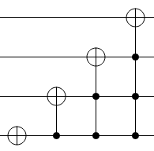

# C. Mystery Circuit

**time limit per test:** 1 second

**memory limit per test:** 256 megabytes

**input:** standard input

**output:** standard output





#### Input

The input contains a single integer $a$ ($0 \le a \le 15$).

#### Output

Output a single integer.

#### Example

#### Input
```
3
```

#### Output
```
13
```
