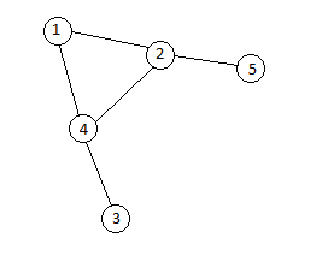
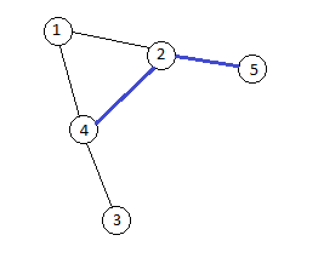
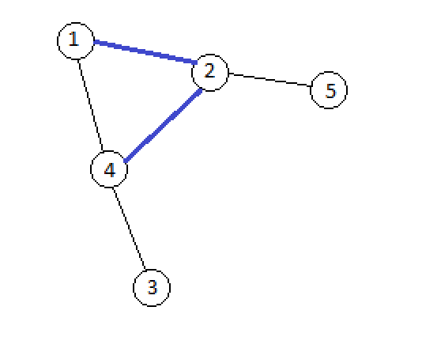

# E. Tree or not Tree

**time limit per test:** 5 seconds

**memory limit per test:** 256 megabytes

**input:** stdin

**output:** stdout

You are given an undirected connected graph *G* consisting of *n* vertexes and *n* edges. *G* contains no self-loops or multiple edges. Let each edge has two states: on and off. Initially all edges are switched off.

You are also given *m* queries represented as (*v*, *u*) — change the state of all edges on the shortest path from vertex *v* to vertex *u* in graph *G*. If there are several such paths, the lexicographically minimal one is chosen. More formally, let us consider all shortest paths from vertex *v* to vertex *u* as the sequences of vertexes *v*, *v*~1~, *v*~2~, ..., *u*. Among such sequences we choose the lexicographically minimal one.

After each query you should tell how many connected components has the graph whose vertexes coincide with the vertexes of graph *G* and edges coincide with the switched on edges of graph *G*.

#### Input

The first line contains two integers *n* and *m* (3 ≤ *n* ≤ 10^5^, 1 ≤ *m* ≤ 10^5^). Then *n* lines describe the graph edges as *a* *b* (1 ≤ *a*, *b* ≤ *n*). Next *m* lines contain the queries as *v* *u* (1 ≤ *v*, *u* ≤ *n*).

It is guaranteed that the graph is connected, does not have any self-loops or multiple edges.

#### Output

Print *m* lines, each containing one integer — the query results.

#### Examples

#### Input
```
5 2
2 1
4 3
2 4
2 5
4 1
5 4
1 5
```

#### Output
```
3
3
```

#### Input
```
6 2
4 6
4 3
1 2
6 5
1 5
1 4
2 5
2 6
```

#### Output
```
4
3
```

#### Note

Let's consider the first sample. We'll highlight the switched on edges blue on the image.

- The graph before applying any operations. No graph edges are switched on, that's why there initially are 5 connected components.




- The graph after query *v* = 5, *u* = 4. We can see that the graph has three components if we only consider the switched on edges.




- The graph after query *v* = 1, *u* = 5. We can see that the graph has three components if we only consider the switched on edges.




Lexicographical comparison of two sequences of equal length of *k* numbers should be done as follows. Sequence *x* is lexicographically less than sequence *y* if exists such *i* (1 ≤ *i* ≤ *k*), so that *x*~*i*~ < *y*~*i*~, and for any *j* (1 ≤ *j* < *i*) *x*~*j*~ = *y*~*j*~.
