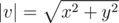

# J. Minimum Sum

**time limit per test:** 2 seconds

**memory limit per test:** 256 megabytes

**input:** input.txt

**output:** output.txt

You are given a set of *n* vectors on a plane. For each vector you are allowed to multiply any of its coordinates by -1. Thus, each vector *v*~*i*~ = (*x*~*i*~, *y*~*i*~) can be transformed into one of the following four vectors:

- *v*~*i*~^1^ = (*x*~*i*~, *y*~*i*~),
- *v*~*i*~^2^ = ( - *x*~*i*~, *y*~*i*~),
- *v*~*i*~^3^ = (*x*~*i*~,  - *y*~*i*~),
- *v*~*i*~^4^ = ( - *x*~*i*~,  - *y*~*i*~).

You should find two vectors from the set and determine which of their coordinates should be multiplied by -1 so that the absolute value of the sum of the resulting vectors was minimally possible. More formally, you should choose two vectors *v*~*i*~, *v*~*j*~ (1 ≤ *i*, *j* ≤ *n*, *i* ≠ *j*) and two numbers *k*~1~, *k*~2~ (1 ≤ *k*~1~, *k*~2~ ≤ 4), so that the value of the expression |*v*~*i*~^*k*~1~^ + *v*~*j*~^*k*~2~^| were minimum.

#### Input

The first line contains a single integer *n* (2 ≤ *n* ≤ 10^5^). Then *n* lines contain vectors as pairs of integers "*x*~*i*~ *y*~*i*~" ( - 10000 ≤ *x*~*i*~, *y*~*i*~ ≤ 10000), one pair per line.

#### Output

Print on the first line four space-separated numbers "*i* *k*~1~ *j* *k*~2~" — the answer to the problem. If there are several variants the absolute value of whose sums is minimum, you can print any of them.

#### Examples

#### Input
```
5
-7 -3
9 0
-8 6
7 -8
4 -5
```

#### Output
```
3 2 4 2
```

#### Input
```
5
3 2
-4 7
-6 0
-8 4
5 1
```

#### Output
```
3 4 5 4
```

#### Note

A sum of two vectors *v* = (*x*~*v*~, *y*~*v*~) and *u* = (*x*~*u*~, *y*~*u*~) is vector *s* = *v* + *u* = (*x*~*v*~ + *x*~*u*~, *y*~*v*~ + *y*~*u*~).

An absolute value of vector *v* = (*x*, *y*) is number



.

In the second sample there are several valid answers, such as:

(3 1 4 2), (3 1 4 4), (3 4 4 1), (3 4 4 3), (4 1 3 2), (4 1 3 4), (4 2 3 1).
