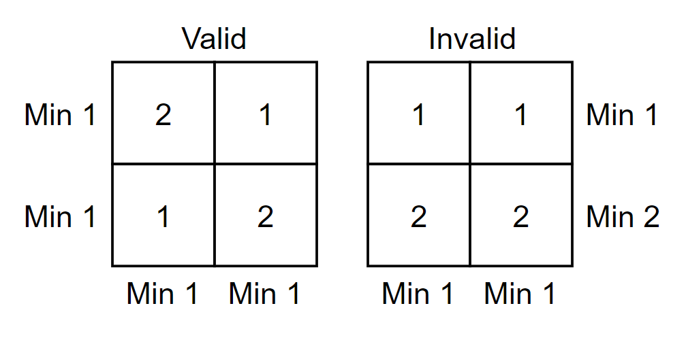
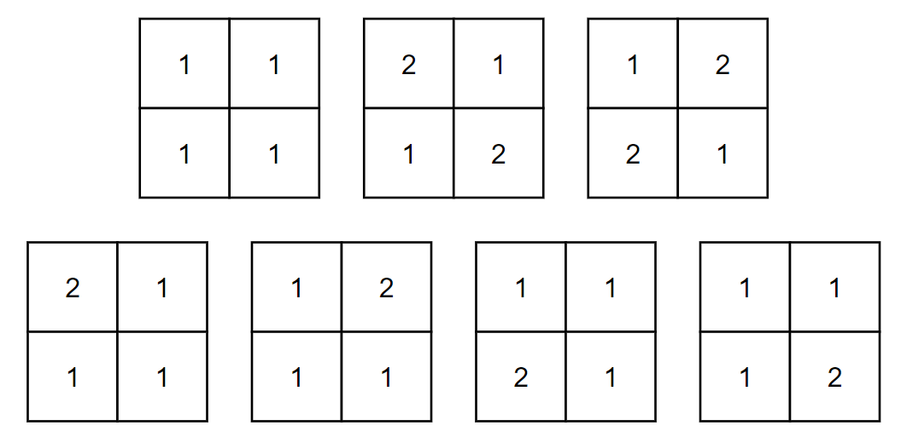

# E. Another Filling the Grid

**time limit per test:** 1 second

**memory limit per test:** 256 megabytes

**input:** standard input

**output:** standard output

You have $n \times n$ square grid and an integer $k$. Put an integer in each cell while satisfying the conditions below.

- All numbers in the grid should be between $1$ and $k$ inclusive.
- Minimum number of the $i$-th row is $1$ ($1 \le i \le n$).
- Minimum number of the $j$-th column is $1$ ($1 \le j \le n$).

Find the number of ways to put integers in the grid. Since the answer can be very large, find the answer modulo $(10^{9} + 7)$.




 These are the examples of valid and invalid grid when $n=k=2$.

#### Input

The only line contains two integers $n$ and $k$ ($1 \le n \le 250$, $1 \le k \le 10^{9}$).

#### Output

Print the answer modulo $(10^{9} + 7)$.

#### Examples

#### Input
```
2 2
```

#### Output
```
7
```

#### Input
```
123 456789
```

#### Output
```
689974806
```

#### Note

In the first example, following $7$ cases are possible.





In the second example, make sure you print the answer modulo $(10^{9} + 7)$.
