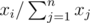
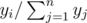

# E. Maze

**time limit per test:** 1 second

**memory limit per test:** 256 megabytes

**input:** stdin

**output:** stdout

A maze is represented by a tree (an undirected graph, where exactly one way exists between each pair of vertices). In the maze the entrance vertex and the exit vertex are chosen with some probability. The exit from the maze is sought by Deep First Search. If there are several possible ways to move, the move is chosen equiprobably. Consider the following pseudo-code:
```
DFS(x)
    if x == exit vertex then
        finish search
    flag[x] <- TRUE
    random shuffle the vertices' order in V(x) // here all permutations have equal probability to be chosen
    for i <- 1 to length[V] do
        if flag[V[i]] = FALSE then
            count++;
            DFS(y);
    count++;
```

*V*(*x*) is the list vertices adjacent to *x*. The *flag* array is initially filled as FALSE. *DFS* initially starts with a parameter of an entrance vertex. When the search is finished, variable *count* will contain the number of moves.

Your task is to count the mathematical expectation of the number of moves one has to do to exit the maze.

#### Input

The first line determines the number of vertices in the graph *n* (1 ≤ *n* ≤ 10^5^). The next *n* - 1 lines contain pairs of integers *a*~*i*~ and *b*~*i*~, which show the existence of an edge between *a*~*i*~ and *b*~*i*~ vertices (1 ≤ *a*~*i*~, *b*~*i*~ ≤ *n*). It is guaranteed that the given graph is a tree.

Next *n* lines contain pairs of non-negative numbers *x*~*i*~ and *y*~*i*~, which represent the probability of choosing the *i*-th vertex as an entrance and exit correspondingly. The probabilities to choose vertex *i* as an entrance and an exit equal



 and



 correspondingly. The sum of all *x*~*i*~ and the sum of all *y*~*i*~ are positive and do not exceed 10^6^.

#### Output

Print the expectation of the number of moves. The absolute or relative error should not exceed 10^ - 9^.

#### Examples

#### Input
```
2
1 2
0 1
1 0
```

#### Output
```
1.00000000000000000000
```

#### Input
```
3
1 2
1 3
1 0
0 2
0 3
```

#### Output
```
2.00000000000000000000
```

#### Input
```
7
1 2
1 3
2 4
2 5
3 6
3 7
1 1
1 1
1 1
1 1
1 1
1 1
1 1
```

#### Output
```
4.04081632653
```

#### Note

In the first sample the entrance vertex is always 1 and the exit vertex is always 2.

In the second sample the entrance vertex is always 1 and the exit vertex with the probability of 2/5 will be 2 of with the probability if 3/5 will be 3. The mathematical expectations for the exit vertices 2 and 3 will be equal (symmetrical cases). During the first move one can go to the exit vertex with the probability of 0.5 or to go to a vertex that's not the exit vertex with the probability of 0.5. In the first case the number of moves equals 1, in the second one it equals 3. The total mathematical expectation is counted as 2 / 5 × (1 × 0.5 + 3 × 0.5) + 3 / 5 × (1 × 0.5 + 3 × 0.5)
