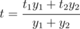

# A. Hot Bath

**time limit per test:** 2 seconds

**memory limit per test:** 256 megabytes

**input:** stdin

**output:** stdout

Bob is about to take a hot bath.

There are two taps to fill the bath: a hot water tap and a cold water tap. The cold water's temperature is *t*~1~, and the hot water's temperature is *t*~2~. The cold water tap can transmit any integer number of water units per second from 0 to *x*~1~, inclusive. Similarly, the hot water tap can transmit from 0 to *x*~2~ water units per second.

If *y*~1~ water units per second flow through the first tap and *y*~2~ water units per second flow through the second tap, then the resulting bath water temperature will be:



Bob wants to open both taps so that the bath water temperature was not less than *t*~0~. However, the temperature should be as close as possible to this value. If there are several optimal variants, Bob chooses the one that lets fill the bath in the quickest way possible.

Determine how much each tap should be opened so that Bob was pleased with the result in the end.

#### Input

You are given five integers *t*~1~, *t*~2~, *x*~1~, *x*~2~ and *t*~0~ (1 ≤ *t*~1~ ≤ *t*~0~ ≤ *t*~2~ ≤ 10^6^, 1 ≤ *x*~1~, *x*~2~ ≤ 10^6^).

#### Output

Print two space-separated integers *y*~1~ and *y*~2~ (0 ≤ *y*~1~ ≤ *x*~1~, 0 ≤ *y*~2~ ≤ *x*~2~).

#### Examples

#### Input
```
10 70 100 100 25
```

#### Output
```
99 33
```

#### Input
```
300 500 1000 1000 300
```

#### Output
```
1000 0
```

#### Input
```
143 456 110 117 273
```

#### Output
```
76 54
```

#### Note

In the second sample the hot water tap shouldn't be opened, but the cold water tap should be opened at full capacity in order to fill the bath in the quickest way possible.
