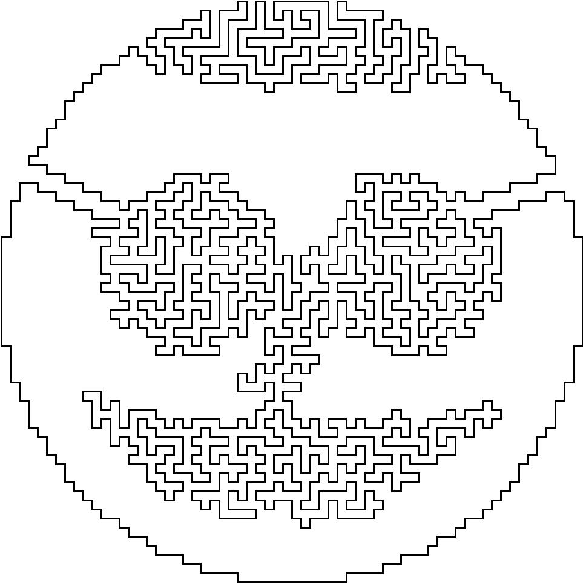

# E. Jordan Smiley

**time limit per test:** 1 second

**memory limit per test:** 256 megabytes

**input:** standard input

**output:** standard output





#### Input

The input contains two integers $row$, $col$ ($0 \le row, col \le 63$), separated by a single space.

#### Output

Output "IN" or "OUT".

#### Examples

#### Input
```
0 0
```

#### Output
```
OUT
```

#### Input
```
27 0
```

#### Output
```
IN
```

#### Input
```
0 27
```

#### Output
```
OUT
```

#### Input
```
27 27
```

#### Output
```
IN
```
