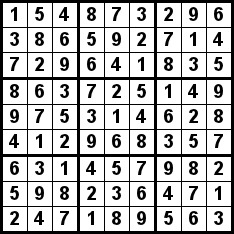

# D. Anti-Sudoku

**time limit per test:** 2 seconds

**memory limit per test:** 256 megabytes

**input:** standard input

**output:** standard output

You are given a correct solution to a Sudoku puzzle. If you don't know what Sudoku is, you can read about it [here](<https://en.wikipedia.org/wiki/Sudoku>).

The picture below shows a correct Sudoku solution:




 Blocks are bordered in bold black.
Your task is to change at most $9$ elements of this field (i. e., choose some $1 \le i, j \le 9$ and change the number at the position $(i, j)$ to any other number in the range $[1; 9]$) to make it anti-sudoku. The anti-sudoku is the $9 \times 9$ field, in which:

- Any number in this field is in the range $[1; 9]$;
- Each row contains at least two equal elements;
- Each column contains at least two equal elements;
- Each $3 \times 3$ block (you can read what a block is following the link above) contains at least two equal elements.

It is guaranteed that a solution exists.

You have to answer $t$ independent test cases.

#### Input

The first line of the input contains one integer $t$ ($1 \le t \le 10^4$) — the number of test cases. Then $t$ test cases follow.

Each test case consists of $9$ lines; each line consists of $9$ characters from $1$ to $9$ without any whitespaces — the correct solution of the Sudoku puzzle.

#### Output

For each test case, print the answer — the initial field with at most $9$ changed elements so that the obtained field is anti-sudoku. If there are several solutions, you can print any. It is guaranteed that the answer exists.

#### Example

#### Input
```
1
154873296
386592714
729641835
863725149
975314628
412968357
631457982
598236471
247189563
```

#### Output
```
154873396
336592714
729645835
863725145
979314628
412958357
631457992
998236471
247789563
```
