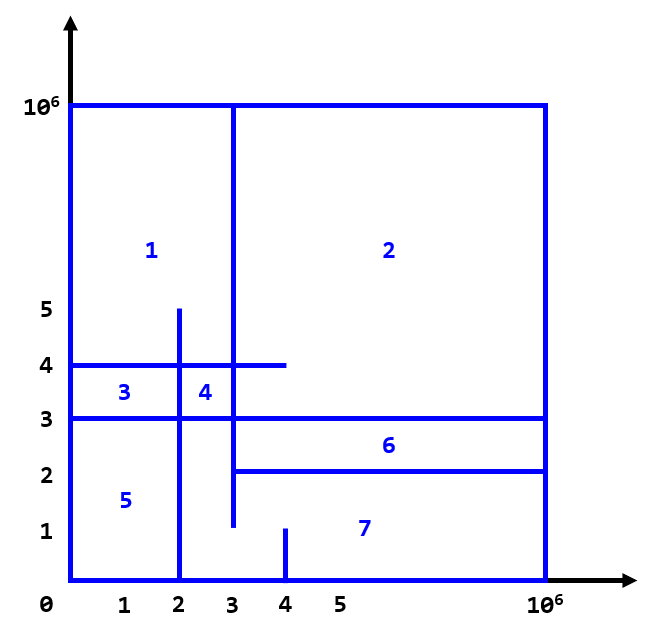

# E. Divide Square

**time limit per test:** 2 seconds

**memory limit per test:** 384 megabytes

**input:** standard input

**output:** standard output

There is a square of size $10^6 \times 10^6$ on the coordinate plane with four points $(0, 0)$, $(0, 10^6)$, $(10^6, 0)$, and $(10^6, 10^6)$ as its vertices.

You are going to draw segments on the plane. All segments are either horizontal or vertical and intersect with at least one side of the square.

Now you are wondering how many pieces this square divides into after drawing all segments. Write a program calculating the number of pieces of the square.

#### Input

The first line contains two integers $n$ and $m$ ($0 \le n, m \le 10^5$) — the number of horizontal segments and the number of vertical segments.

The next $n$ lines contain descriptions of the horizontal segments. The $i$-th line contains three integers $y_i$, $lx_i$ and $rx_i$ ($0 \lt y_i \lt 10^6$; $0 \le lx_i \lt rx_i \le 10^6$), which means the segment connects $(lx_i, y_i)$ and $(rx_i, y_i)$.

The next $m$ lines contain descriptions of the vertical segments. The $i$-th line contains three integers $x_i$, $ly_i$ and $ry_i$ ($0 \lt x_i \lt 10^6$; $0 \le ly_i \lt ry_i \le 10^6$), which means the segment connects $(x_i, ly_i)$ and $(x_i, ry_i)$.

It's guaranteed that there are no two segments on the same line, and each segment intersects with at least one of square's sides.

#### Output

Print the number of pieces the square is divided into after drawing all the segments.

#### Example

#### Input
```
3 3
2 3 1000000
4 0 4
3 0 1000000
4 0 1
2 0 5
3 1 1000000
```

#### Output
```
7
```

#### Note

 The sample is like this:



