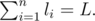
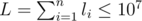

# E. New Year Garland

**time limit per test:** 5 seconds

**memory limit per test:** 256 megabytes

**input:** stdin

**output:** stdout

As Gerald, Alexander, Sergey and Gennady are already busy with the usual New Year chores, Edward hastily decorates the New Year Tree. And any decent New Year Tree must be decorated with a good garland. Edward has lamps of *m* colors and he wants to make a garland from them. That garland should represent a sequence whose length equals *L*. Edward's tree is *n* layers high and Edward plans to hang the garland so as to decorate the first layer with the first *l*~1~ lamps, the second layer — with the next *l*~2~ lamps and so on. The last *n*-th layer should be decorated with the last *l*~*n*~ lamps,




Edward adores all sorts of math puzzles, so he suddenly wondered: how many different ways to assemble the garland are there given that the both following two conditions are met:

- Any two lamps that follow consecutively in the same layer should have different colors.
- The sets of used colors in every two neighbouring layers must be different. We consider unordered sets (not multisets), where every color occurs no more than once. So the number of lamps of particular color does not matter.

Help Edward find the answer to this nagging problem or else he won't manage to decorate the Tree by New Year. You may consider that Edward has an unlimited number of lamps of each of *m* colors and it is not obligatory to use all *m* colors. The garlands are considered different if they differ in at least one position when represented as sequences. Calculate the answer modulo *p*.

#### Input

The first line contains three integers *n*, *m* and *p* (1 ≤ *n*, *m* ≤ 10^6^, 2 ≤ *p* ≤ 10^9^) which are the number of the tree's layers, the number of the lamps' colors and module correspondingly. The next line contains *n* integers *l*~*i*~ (1 ≤ *l*~*i*~ ≤ 5000,



).

#### Output

Print the only integer — the number of garlands modulo *p*.

#### Examples

#### Input
```
3 2 1000
3 1 2
```

#### Output
```
8
```

#### Input
```
2 3 1000
2 2
```

#### Output
```
24
```

#### Input
```
1 1 1000
5
```

#### Output
```
0
```

#### Note

In the first sample the following variants are possible: 121|1|12, 121|1|21, 121|2|12, 121|2|21, 212|1|12, 212|1|21, 212|2|12, 212|2|21. In the second sample the following variants are possible: 12|13, 12|23, 12|31, 12|32 and so on.
 Figure for the first sample:


