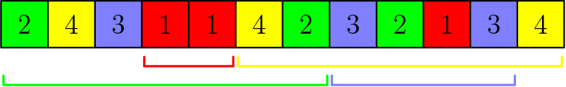
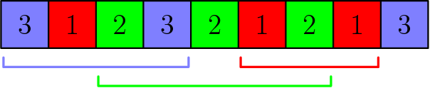

# E. Colors and Intervals

**time limit per test:** 1 second

**memory limit per test:** 256 megabytes

**input:** standard input

**output:** standard output

The numbers $1, \, 2, \, \dots, \, n \cdot k$ are colored with $n$ colors. These colors are indexed by $1, \, 2, \, \dots, \, n$. For each $1 \le i \le n$, there are exactly $k$ numbers colored with color $i$.

Let $[a, \, b]$ denote the interval of integers between $a$ and $b$ inclusive, that is, the set $\{a, \, a + 1, \, \dots, \, b\}$. You must choose $n$ intervals $[a_1, \, b_1], \, [a_2, \, b_2], \, \dots, [a_n, \, b_n]$ such that:

- for each $1 \le i \le n$, it holds $1 \le a_i \lt b_i \le n \cdot k$;
- for each $1 \le i \le n$, the numbers $a_i$ and $b_i$ are colored with color $i$;
- each number $1 \le x \le n \cdot k$ belongs to at most $\left\lceil \frac{n}{k - 1} \right\rceil$ intervals.

One can show that such a family of intervals always exists under the given constraints.

#### Input

The first line contains two integers $n$ and $k$ ($1 \le n \le 100$, $2 \le k \le 100$) — the number of colors and the number of occurrences of each color.

The second line contains $n \cdot k$ integers $c_1, \, c_2, \, \dots, \, c_{nk}$ ($1 \le c_j \le n$), where $c_j$ is the color of number $j$. It is guaranteed that, for each $1 \le i \le n$, it holds $c_j = i$ for exactly $k$ distinct indices $j$.

#### Output

Output $n$ lines. The $i$-th line should contain the two integers $a_i$ and $b_i$.

If there are multiple valid choices of the intervals, output any.

#### Examples

#### Input
```
4 3
2 4 3 1 1 4 2 3 2 1 3 4
```

#### Output
```
4 5
1 7
8 11
6 12
```

#### Input
```
1 2
1 1
```

#### Output
```
1 2
```

#### Input
```
3 3
3 1 2 3 2 1 2 1 3
```

#### Output
```
6 8
3 7
1 4
```

#### Input
```
2 3
2 1 1 1 2 2
```

#### Output
```
2 3
5 6
```

#### Note

In the first sample, each number can be contained in at most $\left\lceil \frac{4}{3 - 1} \right\rceil = 2$ intervals. The output is described by the following picture:





In the second sample, the only interval to be chosen is forced to be $[1, \, 2]$, and each number is indeed contained in at most $\left\lceil \frac{1}{2 - 1} \right\rceil = 1$ interval.

In the third sample, each number can be contained in at most $\left\lceil \frac{3}{3 - 1} \right\rceil = 2$ intervals. The output is described by the following picture:



