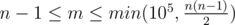

# D. Edges in MST

**time limit per test:** 2 seconds

**memory limit per test:** 256 megabytes

**input:** stdin

**output:** stdout

You are given a connected weighted undirected graph without any loops and multiple edges.

Let us remind you that a graph's spanning tree is defined as an acyclic connected subgraph of the given graph that includes all of the graph's vertexes. The weight of a tree is defined as the sum of weights of the edges that the given tree contains. The minimum spanning tree (MST) of a graph is defined as the graph's spanning tree having the minimum possible weight. For any connected graph obviously exists the minimum spanning tree, but in the general case, a graph's minimum spanning tree is not unique.

Your task is to determine the following for each edge of the given graph: whether it is either included in any MST, or included at least in one MST, or not included in any MST.

#### Input

The first line contains two integers *n* and *m* (2 ≤ *n* ≤ 10^5^,



) — the number of the graph's vertexes and edges, correspondingly. Then follow *m* lines, each of them contains three integers — the description of the graph's edges as "*a*~*i*~ *b*~*i*~ *w*~*i*~" (1 ≤ *a*~*i*~, *b*~*i*~ ≤ *n*, 1 ≤ *w*~*i*~ ≤ 10^6^, *a*~*i*~ ≠ *b*~*i*~), where *a*~*i*~ and *b*~*i*~ are the numbers of vertexes connected by the *i*-th edge, *w*~*i*~ is the edge's weight. It is guaranteed that the graph is connected and doesn't contain loops or multiple edges.

#### Output

Print *m* lines — the answers for all edges. If the *i*-th edge is included in any MST, print "any"; if the *i*-th edge is included at least in one MST, print "at least one"; if the *i*-th edge isn't included in any MST, print "none". Print the answers for the edges in the order in which the edges are specified in the input.

#### Examples

#### Input
```
4 5
1 2 101
1 3 100
2 3 2
2 4 2
3 4 1
```

#### Output
```
none
any
at least one
at least one
any
```

#### Input
```
3 3
1 2 1
2 3 1
1 3 2
```

#### Output
```
any
any
none
```

#### Input
```
3 3
1 2 1
2 3 1
1 3 1
```

#### Output
```
at least one
at least one
at least one
```

#### Note

In the second sample the MST is unique for the given graph: it contains two first edges.

In the third sample any two edges form the MST for the given graph. That means that each edge is included at least in one MST.
