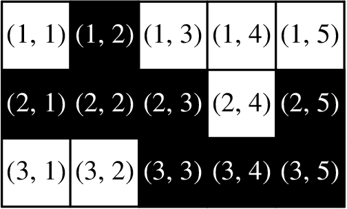
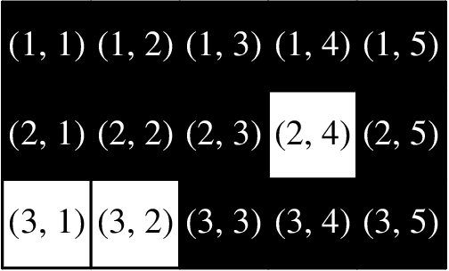
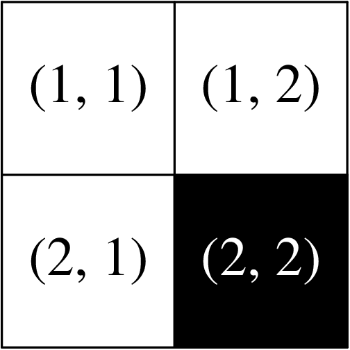
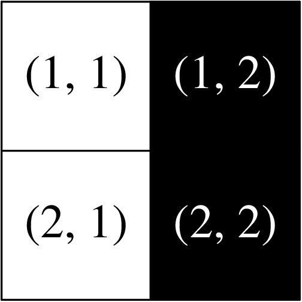
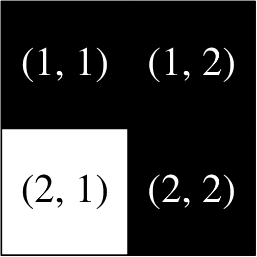

# A. Not Shading

**time limit per test:** 1 second

**memory limit per test:** 256 megabytes

**input:** standard input

**output:** standard output

There is a grid with $n$ rows and $m$ columns. Some cells are colored black, and the rest of the cells are colored white.

In one operation, you can select some black cell and do exactly one of the following:

- color all cells in its row black, or
- color all cells in its column black.

You are given two integers $r$ and $c$. Find the minimum number of operations required to make the cell in row $r$ and column $c$ black, or determine that it is impossible.

#### Input

The input consists of multiple test cases. The first line contains an integer $t$ ($1 \leq t \leq 100$) — the number of test cases. The description of the test cases follows.

The first line of each test case contains four integers $n$, $m$, $r$, and $c$ ($1 \leq n, m \leq 50$; $1 \leq r \leq n$; $1 \leq c \leq m$) — the number of rows and the number of columns in the grid, and the row and column of the cell you need to turn black, respectively.

Then $n$ lines follow, each containing $m$ characters. Each of these characters is either 'B' or 'W' — a black and a white cell, respectively.

#### Output

For each test case, if it is impossible to make the cell in row $r$ and column $c$ black, output $-1$.

Otherwise, output a single integer — the minimum number of operations required to make the cell in row $r$ and column $c$ black.

#### Example

#### Input
```
9
3 5 1 4
WBWWW
BBBWB
WWBBB
4 3 2 1
BWW
BBW
WBB
WWB
2 3 2 2
WWW
WWW
2 2 1 1
WW
WB
5 9 5 9
WWWWWWWWW
WBWBWBBBW
WBBBWWBWW
WBWBWBBBW
WWWWWWWWW
1 1 1 1
B
1 1 1 1
W
1 2 1 1
WB
2 1 1 1
W
B
```

#### Output
```
1
0
-1
2
2
0
-1
1
1
```

#### Note

The first test case is pictured below.





We can take the black cell in row $1$ and column $2$, and make all cells in its row black. Therefore, the cell in row $1$ and column $4$ will become black.





In the second test case, the cell in row $2$ and column $1$ is already black.

In the third test case, it is impossible to make the cell in row $2$ and column $2$ black.

The fourth test case is pictured below.





We can take the black cell in row $2$ and column $2$ and make its column black.





Then, we can take the black cell in row $1$ and column $2$ and make its row black.





Therefore, the cell in row $1$ and column $1$ will become black.
