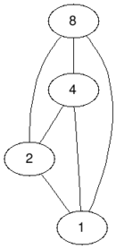
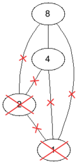
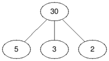
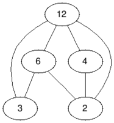
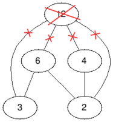
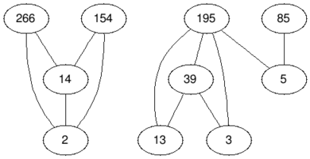
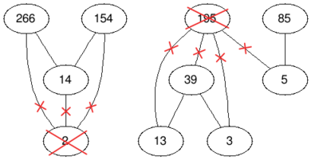

# F. Making It Bipartite

**time limit per test:** 4 seconds

**memory limit per test:** 512 megabytes

**input:** standard input

**output:** standard output

You are given an undirected graph of $n$ vertices indexed from $1$ to $n$, where vertex $i$ has a value $a_i$ assigned to it and all values $a_i$ are different. There is an edge between two vertices $u$ and $v$ if either $a_u$ divides $a_v$ or $a_v$ divides $a_u$.

Find the minimum number of vertices to remove such that the remaining graph is bipartite, when you remove a vertex you remove all the edges incident to it.

#### Input

The input consists of multiple test cases. The first line contains a single integer $t$ ($1 \le t \le 10^4$) — the number of test cases. Description of the test cases follows.

The first line of each test case contains a single integer $n$ ($1 \le n \le 5\cdot10^4$) — the number of vertices in the graph.

The second line of each test case contains $n$ integers, the $i$-th of them is the value $a_i$ ($1 \le a_i \le 5\cdot10^4$) assigned to the $i$-th vertex, all values $a_i$ are different.

It is guaranteed that the sum of $n$ over all test cases does not exceed $5\cdot10^4$.

#### Output

For each test case print a single integer — the minimum number of vertices to remove such that the remaining graph is bipartite.

#### Example

#### Input
```
4
4
8 4 2 1
4
30 2 3 5
5
12 4 6 2 3
10
85 195 5 39 3 13 266 154 14 2
```

#### Output
```
2
0
1
2
```

#### Note

In the first test case if we remove the vertices with values $1$ and $2$ we will obtain a bipartite graph, so the answer is $2$, it is impossible to remove less than $2$ vertices and still obtain a bipartite graph.
 BeforeAfter





 test case #1
In the second test case we do not have to remove any vertex because the graph is already bipartite, so the answer is $0$.
 BeforeAfter




 test case #2
In the third test case we only have to remove the vertex with value $12$, so the answer is $1$.
 BeforeAfter





 test case #3
In the fourth test case we remove the vertices with values $2$ and $195$, so the answer is $2$.
 BeforeAfter





 test case #4
