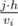
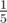

# B. Lemmings

**time limit per test:** 1 second

**memory limit per test:** 256 megabytes

**input:** stdin

**output:** stdout

As you know, lemmings like jumping. For the next spectacular group jump *n* lemmings gathered near a high rock with *k* comfortable ledges on it. The first ledge is situated at the height of *h* meters, the second one is at the height of 2*h* meters, and so on (the *i*-th ledge is at the height of *i*·*h* meters). The lemmings are going to jump at sunset, and there's not much time left.

Each lemming is characterized by its climbing speed of *v*~*i*~ meters per minute and its weight *m*~*i*~. This means that the *i*-th lemming can climb to the *j*-th ledge in



 minutes.

To make the jump beautiful, heavier lemmings should jump from higher ledges: if a lemming of weight *m*~*i*~ jumps from ledge *i*, and a lemming of weight *m*~*j*~ jumps from ledge *j* (for *i* < *j*), then the inequation *m*~*i*~ ≤ *m*~*j*~ should be fulfilled.

Since there are *n* lemmings and only *k* ledges (*k* ≤ *n*), the *k* lemmings that will take part in the jump need to be chosen. The chosen lemmings should be distributed on the ledges from 1 to *k*, one lemming per ledge. The lemmings are to be arranged in the order of non-decreasing weight with the increasing height of the ledge. In addition, each lemming should have enough time to get to his ledge, that is, the time of his climb should not exceed *t* minutes. The lemmings climb to their ledges all at the same time and they do not interfere with each other.

Find the way to arrange the lemmings' jump so that time *t* is minimized.

#### Input

The first line contains space-separated integers *n*, *k* and *h* (1 ≤ *k* ≤ *n* ≤ 10^5^, 1 ≤ *h* ≤ 10^4^) — the total number of lemmings, the number of ledges and the distance between adjacent ledges.

The second line contains *n* space-separated integers *m*~1~, *m*~2~, ..., *m*~*n*~ (1 ≤ *m*~*i*~ ≤ 10^9^), where *m*~*i*~ is the weight of *i*-th lemming.

The third line contains *n* space-separated integers *v*~1~, *v*~2~, ..., *v*~*n*~ (1 ≤ *v*~*i*~ ≤ 10^9^), where *v*~*i*~ is the speed of *i*-th lemming.

#### Output

Print *k* different numbers from 1 to *n* — the numbers of the lemmings who go to ledges at heights *h*, 2*h*, ..., *kh*, correspondingly, if the jump is organized in an optimal way. If there are multiple ways to select the lemmings, pick any of them.

#### Examples

#### Input
```
5 3 2
1 2 3 2 1
1 2 1 2 10
```

#### Output
```
5 2 4
```

#### Input
```
5 3 10
3 4 3 2 1
5 4 3 2 1
```

#### Output
```
4 3 1
```

#### Note

Let's consider the first sample case. The fifth lemming (speed 10) gets to the ledge at height 2 in



 minutes; the second lemming (speed 2) gets to the ledge at height 4 in 2 minutes; the fourth lemming (speed 2) gets to the ledge at height 6 in 3 minutes. All lemmings manage to occupy their positions in 3 minutes.
