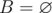
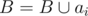
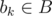
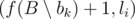
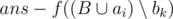
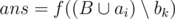
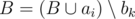

# E. Polycarpus and Tasks

**time limit per test:** 3 seconds

**memory limit per test:** 256 megabytes

**input:** stdin

**output:** stdout

Polycarpus has many tasks. Each task is characterized by three integers *l*~*i*~, *r*~*i*~ and *t*~*i*~. Three integers (*l*~*i*~, *r*~*i*~, *t*~*i*~) mean that to perform task *i*, one needs to choose an integer *s*~*i*~ (*l*~*i*~ ≤ *s*~*i*~; *s*~*i*~ + *t*~*i*~ - 1 ≤ *r*~*i*~), then the task will be carried out continuously for *t*~*i*~ units of time, starting at time *s*~*i*~ and up to time *s*~*i*~ + *t*~*i*~ - 1, inclusive. In other words, a task is performed for a continuous period of time lasting *t*~*i*~, should be started no earlier than *l*~*i*~, and completed no later than *r*~*i*~.

Polycarpus's tasks have a surprising property: for any task *j*, *k* (with *j* < *k*) *l*~*j*~ < *l*~*k*~ and *r*~*j*~ < *r*~*k*~.

Let's suppose there is an ordered set of tasks *A*, containing |*A*| tasks. We'll assume that *a*~*j*~ = (*l*~*j*~, *r*~*j*~, *t*~*j*~) (1 ≤ *j* ≤ |*A*|). Also, we'll assume that the tasks are ordered by increasing *l*~*j*~ with the increase in number.

Let's consider the following recursive function *f*, whose argument is an ordered set of tasks *A*, and the result is an integer. The function *f*(*A*) is defined by the greedy algorithm, which is described below in a pseudo-language of programming.

- Step 1.



, *ans* = 0.
- Step 2. We consider all tasks in the order of increasing of their numbers in the set *A*. Lets define the current task counter *i* = 0.
- Step 3. Consider the next task: *i* = *i* + 1. If *i* > |*A*| fulfilled, then go to the 8 step.
- Step 4. If you can get the task done starting at time *s*~*i*~ = max(*ans* + 1, *l*~*i*~), then do the task *i*: *s*~*i*~ = max(*ans* + 1, *l*~*i*~), *ans* = *s*~*i*~ + *t*~*i*~ - 1,



. Go to the next task (step 3).
- Step 5. Otherwise, find such task



, that first, task *a*~*i*~ can be done at time *s*~*i*~ = max



, and secondly, the value of



 is positive and takes the maximum value among all *b*~*k*~ that satisfy the first condition. If you can choose multiple tasks as *b*~*k*~, choose the one with the maximum number in set *A*.
- Step 6. If you managed to choose task *b*~*k*~, then



,



. Go to the next task (step 3).
- Step 7. If you didn't manage to choose task *b*~*k*~, then skip task *i*. Go to the next task (step 3).
- Step 8. Return *ans* as a result of executing *f*(*A*).

Polycarpus got entangled in all these formulas and definitions, so he asked you to simulate the execution of the function *f*, calculate the value of *f*(*A*).

#### Input

The first line of the input contains a single integer *n* (1 ≤ *n* ≤ 10^5^) — the number of tasks in set *A*.

Then *n* lines describe the tasks. The *i*-th line contains three space-separated integers *l*~*i*~, *r*~*i*~, *t*~*i*~ (1 ≤ *l*~*i*~ ≤ *r*~*i*~ ≤ 10^9^, 1 ≤ *t*~*i*~ ≤ *r*~*i*~ - *l*~*i*~ + 1) — the description of the *i*-th task.

It is guaranteed that for any tasks *j*, *k* (considering that *j* < *k*) the following is true: *l*~*j*~ < *l*~*k*~ and *r*~*j*~ < *r*~*k*~.

#### Output

For each task *i* print a single integer — the result of processing task *i* on the *i*-th iteration of the cycle (step 3) in function *f*(*A*). In the *i*-th line print:

- 0 — if you managed to add task *i* on step 4.
- -1 — if you didn't manage to add or replace task *i* (step 7).
- *res*~*i*~ (1 ≤ *res*~*i*~ ≤ *n*) — if you managed to replace the task (step 6): *res*~*i*~ equals the task number (in set *A*), that should be chosen as *b*~*k*~ and replaced by task *a*~*i*~.

#### Examples

#### Input
```
5
1 8 5
2 9 3
3 10 3
8 11 4
11 12 2
```

#### Output
```
0 0 1 0 -1 
```

#### Input
```
13
1 8 5
2 9 4
3 10 1
4 11 3
8 12 5
9 13 5
10 14 5
11 15 1
12 16 1
13 17 1
14 18 3
15 19 3
16 20 2
```

#### Output
```
0 0 0 2 -1 -1 0 0 0 0 7 0 12 
```
