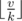
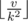
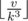
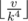
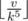
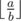
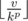

# B. Burning Midnight Oil

**time limit per test:** 2 seconds

**memory limit per test:** 256 megabytes

**input:** stdin

**output:** stdout

One day a highly important task was commissioned to Vasya — writing a program in a night. The program consists of *n* lines of code. Vasya is already exhausted, so he works like that: first he writes *v* lines of code, drinks a cup of tea, then he writes as much as



 lines, drinks another cup of tea, then he writes



 lines and so on:



,



,



, ...

The expression



 is regarded as the integral part from dividing number *a* by number *b*.

The moment the current value



 equals 0, Vasya immediately falls asleep and he wakes up only in the morning, when the program should already be finished.

Vasya is wondering, what minimum allowable value *v* can take to let him write not less than *n* lines of code before he falls asleep.

#### Input

The input consists of two integers *n* and *k*, separated by spaces — the size of the program in lines and the productivity reduction coefficient, 1 ≤ *n* ≤ 10^9^, 2 ≤ *k* ≤ 10.

#### Output

Print the only integer — the minimum value of *v* that lets Vasya write the program in one night.

#### Examples

#### Input
```
7 2
```

#### Output
```
4
```

#### Input
```
59 9
```

#### Output
```
54
```

#### Note

In the first sample the answer is *v* = 4. Vasya writes the code in the following portions: first 4 lines, then 2, then 1, and then Vasya falls asleep. Thus, he manages to write 4 + 2 + 1 = 7 lines in a night and complete the task.

In the second sample the answer is *v* = 54. Vasya writes the code in the following portions: 54, 6. The total sum is 54 + 6 = 60, that's even more than *n* = 59.
