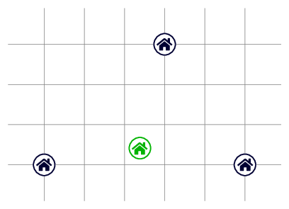
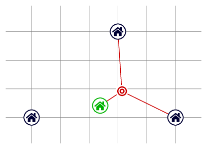

# K. Pandemic Restrictions

**time limit per test:** 4 seconds

**memory limit per test:** 256 megabytes

**input:** standard input

**output:** standard output

After a long time living abroad, you have decided to move back to Italy and have to find a place to live, but things are not so easy due to the ongoing global pandemic.

Your three friends Fabio, Flavio and Francesco live at the points with coordinates $(x_1, y_1), (x_2, y_2)$ and $(x_3, y_3)$, respectively. Due to the mobility restrictions in response to the pandemic, meetings are limited to $3$ persons, so you will only be able to meet $2$ of your friends at a time. Moreover, in order to contain the spread of the infection, the authorities have imposed the following additional measure: for each meeting, the sum of the lengths travelled by each of the attendees from their residence place to the place of the meeting must not exceed $r$.

What is the minimum value of $r$ (which can be any nonnegative real number) for which there exists a place of residence that allows you to hold the three possible meetings involving you and two of your friends? Note that the chosen place of residence need not have integer coordinates.

#### Input

The first line contains the two integers $x_1, y_1$ ($-10^4 \le x_1, y_1 \le 10^4$) — the coordinates of the house of your friend Fabio.

The second line contains the two integers $x_2, y_2$ ($-10^4 \le x_2, y_2 \le 10^4$) — the coordinates of the house of your friend Flavio.

The third line contains the two integers $x_3, y_3$ ($-10^4 \le x_3, y_3 \le 10^4$) — the coordinates of the house of your friend Francesco.

It is guaranteed that your three friends live in different places (i.e., the three points $(x_1, y_1)$, $(x_2, y_2)$, $(x_3, y_3)$ are guaranteed to be distinct).

#### Output

Print the minimum value of $r$ which allows you to find a residence place satisfying the above conditions. Your answer is considered correct if its absolute or relative error does not exceed $10^{-4}$.

Formally, let your answer be $a$, and the jury's answer be $b$. Your answer is accepted if and only if $\frac{|a - b|}{\max{(1, |b|)}} \le 10^{-4}$.

#### Examples

#### Input
```
0 0
5 0
3 3
```

#### Output
```
5.0686143166
```

#### Input
```
-1 0
0 0
1 0
```

#### Output
```
2.0000000000
```

#### Note

In the first sample, Fabio, Flavio and Francesco live at the points with coordinates $(0,0)$, $(5,0)$ and $(3,3)$ respectively. The optimal place of residence, represented by a green house in the picture below, is at the point with coordinates $(2.3842..., 0.4151...)$.




 For instance, it is possible for you to meet Flavio and Francesco at the point depicted below, so that the sum of the lengths travelled by the three attendees is at most (and in fact equal to) $r=5.0686...$.




In the second sample, any point on the segment $\{(x,0):\ -1 \leq x \leq 1 \}$ is an optimal place of residence.
