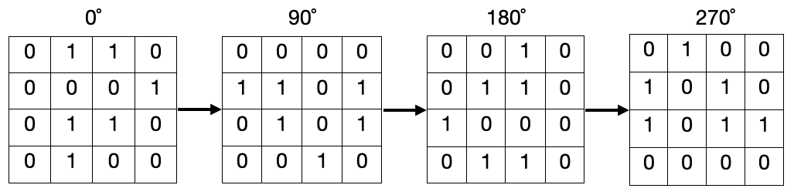

# E. Mirror Grid

**time limit per test:** 2 seconds

**memory limit per test:** 256 megabytes

**input:** standard input

**output:** standard output

You are given a square grid with $n$ rows and $n$ columns. Each cell contains either $0$ or $1$.

In an operation, you can select a cell of the grid and flip it (from $0 \to 1$ or $1 \to 0$). Find the minimum number of operations you need to obtain a square that remains the same when rotated $0^{\circ}$, $90^{\circ}$, $180^{\circ}$ and $270^{\circ}$.

The picture below shows an example of all rotations of a grid.





#### Input

The first line contains a single integer $t$ ($1 \leq t \leq 100$) — the number of test cases.

The first line of each test case contains a single integer $n$ ($1 \leq n \leq 100$) — the size of the grid.

Then $n$ lines follow, each with $n$ characters $a_{i,j}$ ($0 \leq a_{i,j} \leq 1$) — the number written in each cell.

#### Output

For each test case output a single integer  — the minimum number of operations needed to make the square look the same rotated $0^{\circ}$, $90^{\circ}$, $180^{\circ}$ and $270^{\circ}$.

#### Example

#### Input
```
5
3
010
110
010
1
0
5
11100
11011
01011
10011
11000
5
01000
10101
01010
00010
01001
5
11001
00000
11111
10110
01111
```

#### Output
```
1
0
9
7
6
```

#### Note

In the first test case, we can perform one operations to make the grid $\begin{matrix}0 & 1 & 0\\ 1 & 1 & \color{red}{1}\\ 0 & 1 & 0\end{matrix}$. Now, all rotations of the square are the same.

In the second test case, all rotations of the square are already the same, so we don't need any flips.
