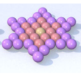

# B. Star

**time limit per test:** 2 seconds

**memory limit per test:** 256 megabytes

**input:** stdin

**output:** stdout





#### Input

The input contains a single integer *a* (1 ≤ *a* ≤ 18257).

#### Output

Print a single integer *output* (1 ≤ *output* ≤ 2·10^9^).

#### Examples

#### Input
```
2
```

#### Output
```
13
```
