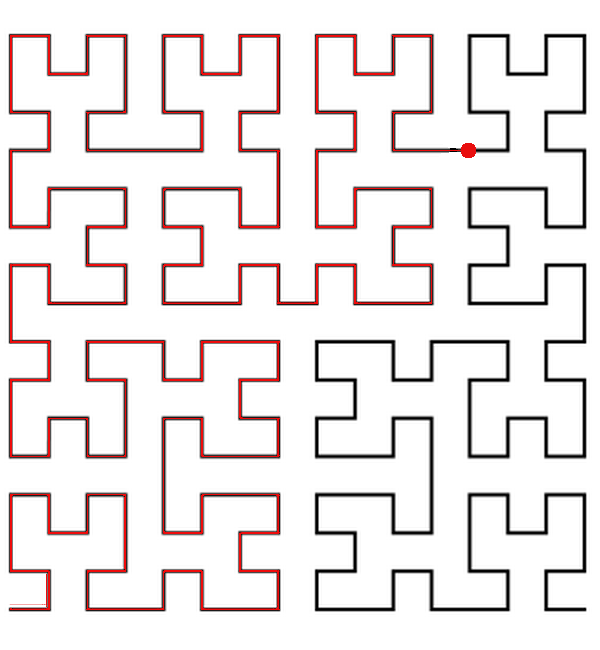

# H. A polyline

**time limit per test:** 2 seconds

**memory limit per test:** 256 megabytes

**input:** stdin

**output:** stdout





#### Input

The input contains two integers *a*, *b* (1 ≤ *a* ≤ 10, 0 ≤ *b* ≤ 2^2·*a*^ - 1) separated by a single space.

#### Output

Output two integers separated by a single space.

#### Examples

#### Input
```
1 0
```

#### Output
```
0 0
```

#### Input
```
2 15
```

#### Output
```
3 0
```

#### Input
```
4 160
```

#### Output
```
12 12
```
