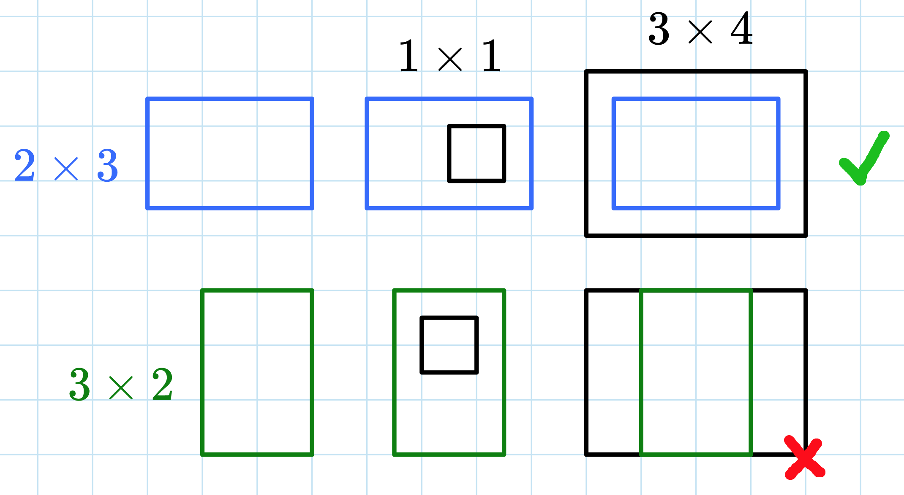

# E. Counting Rectangles

**time limit per test:** 6 seconds

**memory limit per test:** 256 megabytes

**input:** standard input

**output:** standard output

You have $n$ rectangles, the $i$-th rectangle has height $h_i$ and width $w_i$.

You are asked $q$ queries of the form $h_s \ w_s \ h_b \ w_b$.

For each query output, the total area of rectangles you own that can fit a rectangle of height $h_s$ and width $w_s$ while also fitting in a rectangle of height $h_b$ and width $w_b$. In other words, print $\sum h_i \cdot w_i$ for $i$ such that $h_s \lt h_i \lt h_b$ and $w_s \lt w_i \lt w_b$.

Please note, that if two rectangles have the same height or the same width, then they cannot fit inside each other. Also note that you cannot rotate rectangles.

Please note that the answer for some test cases won't fit into 32-bit integer type, so you should use at least 64-bit integer type in your programming language (like long long for C++).

#### Input

The first line of the input contains an integer $t$ ($1 \leq t \leq 100$) — the number of test cases.

The first line of each test case two integers $n, q$ ($1 \leq n \leq 10^5$; $1 \leq q \leq 10^5$) — the number of rectangles you own and the number of queries.

Then $n$ lines follow, each containing two integers $h_i, w_i$ ($1 \leq h_i, w_i \leq 1000$) — the height and width of the $i$-th rectangle.

Then $q$ lines follow, each containing four integers $h_s, w_s, h_b, w_b$ ($1 \leq h_s \lt h_b,\ w_s \lt w_b \leq 1000$) — the description of each query.

The sum of $q$ over all test cases does not exceed $10^5$, and the sum of $n$ over all test cases does not exceed $10^5$.

#### Output

For each test case, output $q$ lines, the $i$-th line containing the answer to the $i$-th query.

#### Example

#### Input
```
3
2 1
2 3
3 2
1 1 3 4
5 5
1 1
2 2
3 3
4 4
5 5
3 3 6 6
2 1 4 5
1 1 2 10
1 1 100 100
1 1 3 3
3 1
999 999
999 999
999 998
1 1 1000 1000
```

#### Output
```
6
41
9
0
54
4
2993004
```

#### Note





In the first test case, there is only one query. We need to find the sum of areas of all rectangles that can fit a $1 \times 1$ rectangle inside of it and fit into a $3 \times 4$ rectangle.

Only the $2 \times 3$ rectangle works, because $1 \lt 2$ (comparing heights) and $1 \lt 3$ (comparing widths), so the $1 \times 1$ rectangle fits inside, and $2 \lt 3$ (comparing heights) and $3 \lt 4$ (comparing widths), so it fits inside the $3 \times 4$ rectangle. The $3 \times 2$ rectangle is too tall to fit in a $3 \times 4$ rectangle. The total area is $2 \cdot 3 = 6$.
