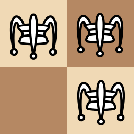
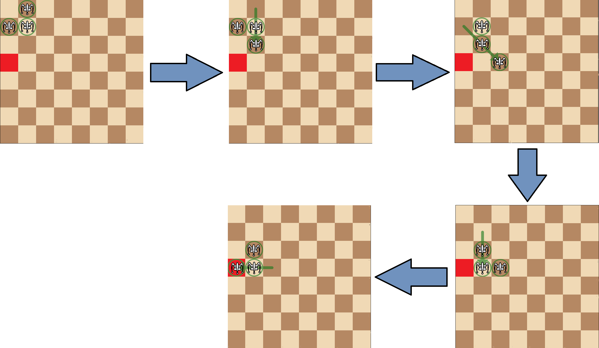

# C. Ela and Crickets

**time limit per test:** 1 second

**memory limit per test:** 256 megabytes

**input:** standard input

**output:** standard output


Ela likes Chess a lot. During breaks, she usually challenges her co-worker in DTL to some chess games. She's not an expert at classic chess, but she's very interested in Chess variants, where she has to adapt to new rules and test her tactical mindset to win the game.

The problem, which involves a non-standard chess pieces type that is described below, reads: given $3$ white crickets on a $n \cdot n$ board, arranged in an "L" shape next to each other, there are no other pieces on the board. Ela wants to know with a finite number of moves, can she put any white cricket on the square on row $x$, column $y$?

An "L"-shape piece arrangement can only be one of the below:





For simplicity, we describe the rules for crickets on the board where only three white crickets are. It can move horizontally, vertically, or diagonally, but only to a square in some direction that is immediately after another cricket piece (so that it must jump over it). If the square immediately behind the piece is unoccupied, the cricket will occupy the square. Otherwise (when the square is occupied by another cricket, or does not exist), the cricket isn't allowed to make such a move.

See an example of valid crickets' moves on the pictures in the Note section.

#### Input

Each test contains multiple test cases. The first line contains the number of test cases $t$ ($1 \le t \le 10^4$). The description of the test cases follows.

The first line of each test case contains $n$ ($4 \le n \le 10^5$) — denotes the size of the chessboard.

The second line of each test case contains 6 numbers: $r_1$, $c_1$, $r_2$, $c_2$, $r_3$, $c_3$ ($1 \le r_1, c_1, r_2, c_2, r_3, c_3 \le n$) — coordinates of the crickets. The input ensures that the three crickets are arranged in an "L" shape that the legend stated.

The third line of each test case contains 2 numbers: $x$, $y$ ($1 \le x, y \le n$) — coordinates of the target square.

#### Output

For each test case, print "YES" or "NO" to denotes whether Ela can put a cricket on the target square.

#### Example

#### Input
```
6
8
7 2 8 2 7 1
5 1
8
2 2 1 2 2 1
5 5
8
2 2 1 2 2 1
6 6
8
1 1 1 2 2 1
5 5
8
2 2 1 2 2 1
8 8
8
8 8 8 7 7 8
4 8
```

#### Output
```
YES
NO
YES
NO
YES
YES
```

#### Note

Here's the solution for the first test case. The red square denotes where the crickets need to reach. Note that in chess horizontals are counted from bottom to top, as well as on this picture.



