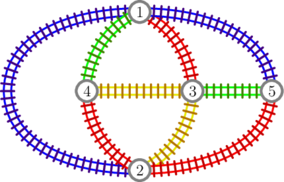
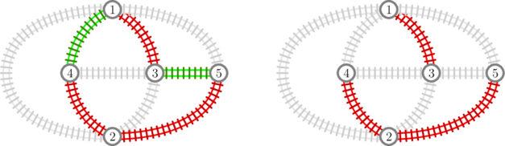
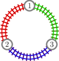

# F. Train Splitting

**time limit per test:** 2 seconds

**memory limit per test:** 256 megabytes

**input:** standard input

**output:** standard output

There are $n$ big cities in Italy, and there are $m$ train routes between pairs of cities. Each route connects two different cities bidirectionally. Moreover, using the trains one can reach every city starting from any other city.

Right now, all the routes are operated by the government-owned Italian Carriage Passenger Company, but the government wants to privatize the routes. The government does not want to give too much power to a single company, but it also does not want to make people buy a lot of different subscriptions. Also, it would like to give a fair chance to all companies. In order to formalize all these wishes, the following model was proposed.

There will be $k \ge 2$ private companies indexed by $1, \, 2, \, \dots, \, k$. Each train route will be operated by exactly one of the $k$ companies. Then:

- For any company, there should exist two cities such that it is impossible to reach one from the other using only routes operated by that company.
- On the other hand, for any two companies, it should be possible to reach every city from any other city using only routes operated by these two companies.

Find a plan satisfying all these criteria. It can be shown that a viable plan always exists. Please note that you can choose the number $k$ and you do not have to minimize or maximize it.

#### Input

Each test contains multiple test cases. The first line contains an integer $t$ ($1 \le t \le 1000$) — the number of test cases. The descriptions of the $t$ test cases follow.

The first line of each test case contains two integers $n$ and $m$ ($3 \le n \le 50$, $n-1 \le m \le n(n-1)/2$) — the number of cities and the number of train routes.

The next $m$ lines contain two integers $u_i$ and $v_i$ each ($1 \le u_i, v_i \le n$, $u_i \ne v_i$) — the $i$-th train route connects cities $u_i$ and $v_i$.

It is guaranteed that the routes connect $m$ distinct pairs of cities. It is guaranteed that using the trains one can reach every city starting from any other city.

The sum of the values of $n$ over all test cases does not exceed $5000$.

#### Output

For each test case, on the first line print an integer $k$ ($2 \le k \le m$) — the number of companies in your plan; on the second line print $m$ integers $c_1, \, c_2, \, \dots, \, c_m$ ($1 \le c_i \le k$) — in your plan company $c_i$ operates the $i$-th route.

If there are multiple valid plans, you may print any of them.

#### Example

#### Input
```
2
5 9
1 2
1 3
1 4
1 5
2 3
2 4
2 5
3 4
3 5
3 3
1 2
3 1
2 3
```

#### Output
```
4
1 2 3 1 4 2 2 4 3
3
2 3 1
```

#### Note

In the first test case, the output is illustrated in the following picture, where different colors correspond to different companies (blue for $1$, red for $2$, green for $3$, and yellow for $4$):





If we consider, for example, only companies $2$ and $3$, we can see that from any city it is possible to reach every other city (picture on the left below). However, if we restrict to company $2$ alone, it becomes impossible to reach city $5$ from city $1$ (picture on the right).





In the second test case, the output is illustrated in the following picture:



