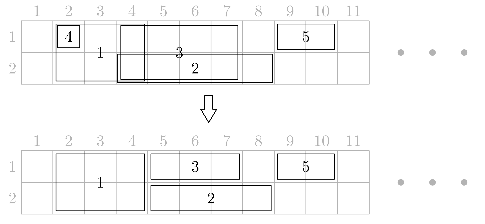

# E. Rectangle Shrinking

**time limit per test:** 4 seconds

**memory limit per test:** 512 megabytes

**input:** standard input

**output:** standard output

You have a rectangular grid of height $2$ and width $10^9$ consisting of unit cells. There are $n$ rectangles placed on this grid, and the borders of these rectangles pass along cell borders. The $i$-th rectangle covers all cells in rows from $u_i$ to $d_i$ inclusive and columns from $l_i$ to $r_i$ inclusive ($1 \le u_i \le d_i \le 2$; $1 \le l_i \le r_i \le 10^9$). The initial rectangles can intersect, be nested, and coincide arbitrarily.

You should either remove each rectangle, or replace it with any of its non-empty subrectangles. In the latter case, the new subrectangle must lie inside the initial rectangle, and its borders must still pass along cell borders. In particular, it is allowed for the subrectangle to be equal to the initial rectangle.

After that replacement, no two (non-removed) rectangles are allowed to have common cells, and the total area covered with the new rectangles must be as large as possible.




 Illustration for the first test case. The initial rectangles are given at the top, the new rectangles are given at the bottom. Rectangle number $4$ is removed.

#### Input

Each test contains multiple test cases. The first line contains the number of test cases $t$ ($1 \le t \le 10^4$). The description of the test cases follows.

The first line of each test case contains a single integer $n$ ($1 \le n \le 2 \cdot 10^5$) — the number of rectangles.

Each of the next $n$ lines contains four integers $u_i, l_i, d_i, r_i$ ($1 \le u_i \le d_i \le 2$; $1 \le l_i \le r_i \le 10^9$) — the coordinates of cells located in the top-left and the bottom-right corners of the rectangle, respectively.

It is guaranteed that the sum of $n$ over all test cases does not exceed $2 \cdot 10^5$.

#### Output

For each test case, first print an integer $s$ — the largest possible covered by new rectangles area. Then print $n$ lines with your solution to cover this area.

In the $i$-th of these lines print four integers $u'_i, l'_i, d'_i, r'_i$. If you remove the $i$-th rectangle, print $u'_i = l'_i = d'_i = r'_i = 0$. Otherwise, these numbers denote the new coordinates of the top-left and the bottom-right corners of the $i$-th rectangle, satisfying $u_i \le u'_i \le d'_i \le d_i$; $l_i \le l'_i \le r'_i \le r_i$.

If there are multiple solutions, print any.

#### Example

#### Input
```
8
5
1 2 2 4
2 4 2 8
1 4 2 7
1 2 1 2
1 9 1 10
2
1 1 1 10
1 5 1 15
2
1 1 1 10
1 1 1 10
5
1 3 1 7
1 3 1 8
1 1 1 4
1 2 1 7
1 10 1 11
2
1 1 2 10
1 5 1 8
2
1 5 2 10
1 2 1 7
2
1 5 2 10
2 2 2 15
5
2 6 2 7
1 4 2 5
1 5 1 9
1 7 2 10
1 2 1 6
```

#### Output
```
15
1 2 2 4
2 5 2 8
1 5 1 7
0 0 0 0
1 9 1 10
15
1 1 1 10
1 11 1 15
10
1 1 1 10
0 0 0 0
10
0 0 0 0
1 8 1 8
1 1 1 4
1 5 1 7
1 10 1 11
20
1 1 2 10
0 0 0 0
15
1 5 2 10
1 2 1 4
20
1 5 1 10
2 2 2 15
16
2 6 2 6
2 4 2 5
0 0 0 0
1 7 2 10
1 2 1 6
```

#### Note

The picture in the statement illustrates the first test case.
