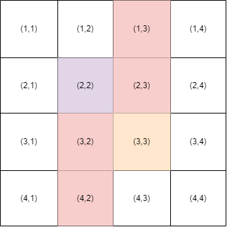

# A. Li Hua and Maze

**time limit per test:** 1 second

**memory limit per test:** 256 megabytes

**input:** standard input

**output:** standard output

There is a rectangular maze of size $n\times m$. Denote $(r,c)$ as the cell on the $r$-th row from the top and the $c$-th column from the left. Two cells are adjacent if they share an edge. A path is a sequence of adjacent empty cells.

Each cell is initially empty. Li Hua can choose some cells (except $(x_1, y_1)$ and $(x_2, y_2)$) and place an obstacle in each of them. He wants to know the minimum number of obstacles needed to be placed so that there isn't a path from $(x_1, y_1)$ to $(x_2, y_2)$.

Suppose you were Li Hua, please solve this problem.

#### Input

The first line contains the single integer $t$ ($1 \le t \le 500$) — the number of test cases.

The first line of each test case contains two integers $n,m$ ($4\le n,m\le 10^9$) — the size of the maze.

The second line of each test case contains four integers $x_1,y_1,x_2,y_2$ ($1\le x_1,x_2\le n, 1\le y_1,y_2\le m$) — the coordinates of the start and the end.

It is guaranteed that $|x_1-x_2|+|y_1-y_2|\ge 2$.

#### Output

For each test case print the minimum number of obstacles you need to put on the field so that there is no path from $(x_1, y_1)$ to $(x_2, y_2)$.

#### Example

#### Input
```
3
4 4
2 2 3 3
6 7
1 1 2 3
9 9
5 1 3 6
```

#### Output
```
4
2
3
```

#### Note

In test case 1, you can put obstacles on $(1,3), (2,3), (3,2), (4,2)$. Then the path from $(2,2)$ to $(3,3)$ will not exist.



