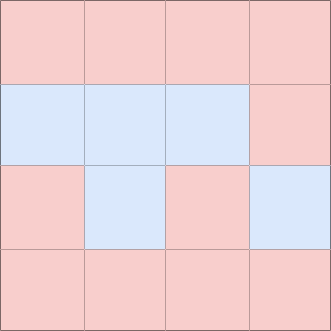
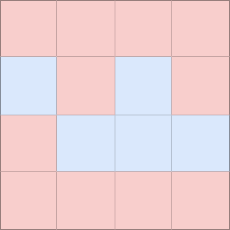
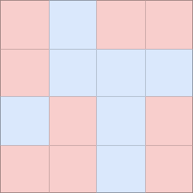
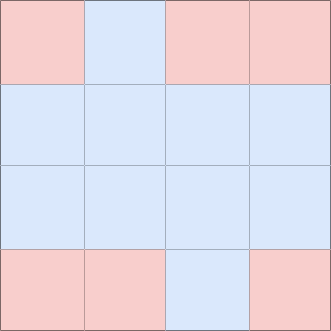

# B. Li Hua and Pattern

**time limit per test:** 1 second

**memory limit per test:** 256 megabytes

**input:** standard input

**output:** standard output

Li Hua has a pattern of size $n\times n$, each cell is either blue or red. He can perform exactly $k$ operations. In each operation, he chooses a cell and changes its color from red to blue or from blue to red. Each cell can be chosen as many times as he wants. Is it possible to make the pattern, that matches its rotation by $180^{\circ}$?

Suppose you were Li Hua, please solve this problem.

#### Input

The first line contains the single integer $t$ ($1 \le t \le 100$) — the number of test cases.

The first line of each test case contains two integers $n,k$ ($1\le n\le 10^3,0\le k \le 10^9$) — the size of the pattern and the number of operations.

Each of next $n$ lines contains $n$ integers $a_{i,j}$ ($a_{i,j}\in\{0,1\}$) — the initial color of the cell, $0$ for blue and $1$ for red.

It's guaranteed that sum of $n$ over all test cases does not exceed $10^3$.

#### Output

For each set of input, print "YES" if it's possible to make the pattern, that matches its rotation by $180^{\circ}$ after applying exactly $k$ of operations, and "NO" otherwise.

You can output the answer in any case (upper or lower). For example, the strings "yEs", "yes", "Yes", and "YES" will be recognized as positive responses.

#### Example

#### Input
```
3
4 0
1 1 1 1
0 0 0 1
1 0 1 0
1 1 1 1
4 3
1 0 1 1
1 0 0 0
0 1 0 1
1 1 0 1
5 4
0 0 0 0 0
0 1 1 1 1
0 1 0 0 0
1 1 1 1 1
0 0 0 0 0
```

#### Output
```
NO
YES
YES
```

#### Note

In test case 1, you can't perform any operation. The pattern after rotation is on the right.







In test case 2, you can perform operations on $(2,1),(3,2),(3,4)$. The pattern after operations is in the middle and the pattern after rotation is on the right.







