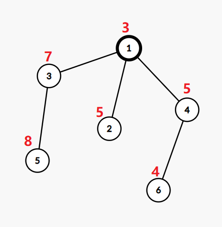
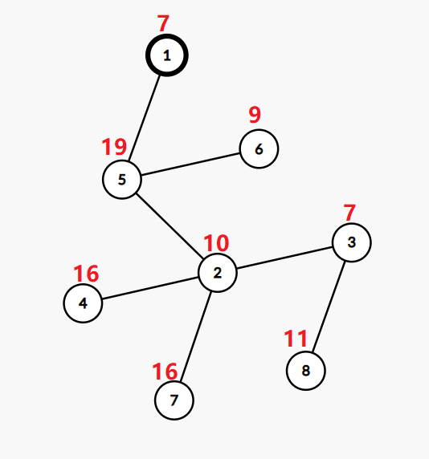

# C. LuoTianyi and XOR-Tree

**time limit per test:** 2 seconds

**memory limit per test:** 256 megabytes

**input:** standard input

**output:** standard output

LuoTianyi gives you a tree with values in its vertices, and the root of the tree is vertex $1$.

In one operation, you can change the value in one vertex to any non-negative integer.

Now you need to find the minimum number of operations you need to perform to make each path from the root to leaf$^{\dagger}$ has a [bitwise XOR](<https://en.wikipedia.org/wiki/Bitwise_operation#XOR>) value of zero.

$^{\dagger}$A leaf in a rooted tree is a vertex that has exactly one neighbor and is not a root.

#### Input

The first line contains a single integer $n$ ($2 \le n \le 10^5$) — the number of vertices in the tree.

The second line contains $n$ integers $a_1, a_2, \ldots, a_n$ ($1 \le a_i \le 10^9$), the $i$-th number represents the value in the $i$-th vertex.

Next $n−1$ lines describe the edges of the tree. The $i$-th line contains two integers $u_i$ and $v_i$ ($1 \le u_i,v_i \le n, u_i \neq v_i$) — the vertices connected by an edge of the tree. It's guaranteed that the given edges form a tree.

#### Output

Print a single integer — the minimum number of operations.

#### Examples

#### Input
```
6
3 5 7 5 8 4
1 2
1 3
1 4
3 5
4 6
```

#### Output
```
3
```

#### Input
```
8
7 10 7 16 19 9 16 11
1 5
4 2
6 5
5 2
7 2
2 3
3 8
```

#### Output
```
3
```

#### Input
```
4
1 2 1 2
1 2
2 3
4 3
```

#### Output
```
0
```

#### Input
```
9
4 3 6 1 5 5 5 2 7
1 2
2 3
4 1
4 5
4 6
4 7
8 1
8 9
```

#### Output
```
2
```

#### Note

The tree in the first example:





If we change the value in the vertex $2$ to $3$, the value in the vertex $5$ to $4$, and the value in the vertex $6$ to $6$, then the tree will be ok.

The bitwise XOR from the root to the leaf $2$ will be $3 \oplus 3=0$.

The bitwise XOR from the root to the leaf $5$ will be $4 \oplus 7 \oplus 3=0$.

The bitwise XOR from the root to the leaf $6$ will be $6 \oplus 5 \oplus 3=0$.

The tree in the second example:





If we change the value in the vertex $2$ to $4$, the value in the vertex $3$ to $27$, and the value in the vertex $6$ to $20$, then the tree will be ok.

The bitwise XOR from the root to the leaf $6$ will be $20 \oplus 19 \oplus 7=0$.

The bitwise XOR from the root to the leaf $8$ will be $11 \oplus 27 \oplus 4 \oplus 19 \oplus 7=0$.

The bitwise XOR from the root to the leaf $4$ will be $16 \oplus 4 \oplus 19 \oplus 7=0$.

The bitwise XOR from the root to the leaf $7$ will be $16 \oplus 4 \oplus 19 \oplus 7=0$.

In the third example, the only leaf is the vertex $4$ and the bitwise XOR on the path to it is $1 \oplus 2 \oplus 1 \oplus 2 = 0$, so we don't need to change values.

In the fourth example, we can change the value in the vertex $1$ to $5$, and the value in the vertex $4$ to $0$.

Here $\oplus$ denotes the bitwise XOR operation.
