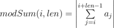
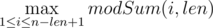

# C. Optimal Sum

**time limit per test:** 2 seconds

**memory limit per test:** 256 megabytes

**input:** stdin

**output:** stdout

And here goes another problem on arrays. You are given positive integer *len* and array *a* which consists of *n* integers *a*~1~, *a*~2~, ..., *a*~*n*~. Let's introduce two characteristics for the given array.

- Let's consider an arbitrary interval of the array with length *len*, starting in position *i*. Value



, is the modular sum on the chosen interval. In other words, the modular sum is the sum of integers on the chosen interval with length *len*, taken in its absolute value.
- Value



 is the optimal sum of the array. In other words, the optimal sum of an array is the maximum of all modular sums on various intervals of array with length *len*.

Your task is to calculate the optimal sum of the given array *a*. However, before you do the calculations, you are allowed to produce no more than *k* consecutive operations of the following form with this array: one operation means taking an arbitrary number from array *a*~*i*~ and multiply it by -1. In other words, no more than *k* times you are allowed to take an arbitrary number *a*~*i*~ from the array and replace it with  - *a*~*i*~. Each number of the array is allowed to choose an arbitrary number of times.

Your task is to calculate the maximum possible optimal sum of the array after at most *k* operations described above are completed.

#### Input

The first line contains two integers *n*, *len* (1 ≤ *len* ≤ *n* ≤ 10^5^) — the number of elements in the array and the length of the chosen subinterval of the array, correspondingly.

The second line contains a sequence consisting of *n* integers *a*~1~, *a*~2~, ..., *a*~*n*~ (|*a*~*i*~| ≤ 10^9^) — the original array.

The third line contains a single integer *k* (0 ≤ *k* ≤ *n*) — the maximum allowed number of operations.

All numbers in lines are separated by a single space.

#### Output

In a single line print the maximum possible optimal sum after no more than *k* acceptable operations are fulfilled.

Please do not use the %lld specifier to read or write 64-bit integers in С++. It is preferred to use cin, cout streams or the %I64d specifier.

#### Examples

#### Input
```
5 3
0 -2 3 -5 1
2
```

#### Output
```
10
```

#### Input
```
5 2
1 -3 -10 4 1
3
```

#### Output
```
14
```

#### Input
```
3 3
-2 -5 4
1
```

#### Output
```
11
```
