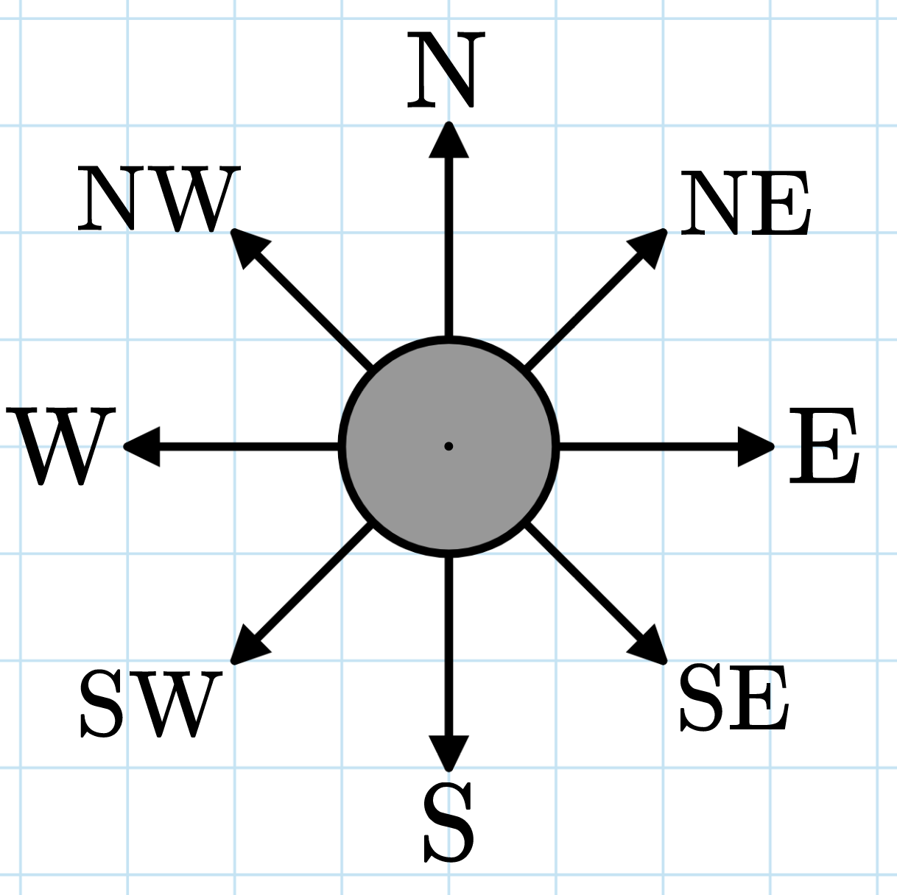

# G. The Morning Star

**time limit per test:** 2 seconds

**memory limit per test:** 256 megabytes

**input:** standard input

**output:** standard output

A compass points directly toward the morning star. It can only point in one of eight directions: the four cardinal directions (N, S, E, W) or some combination (NW, NE, SW, SE). Otherwise, it will break.




 The directions the compass can point.
There are $n$ distinct points with integer coordinates on a plane. How many ways can you put a compass at one point and the morning star at another so that the compass does not break?

#### Input

Each test contains multiple test cases. The first line contains the number of test cases $t$ ($1 \le t \le 10^4$). The description of the test cases follows.

The first line of each test case contains a single integer $n$ ($2 \leq n \leq 2 \cdot 10^5$) — the number of points.

Then $n$ lines follow, each line containing two integers $x_i$, $y_i$ ($-10^9 \leq x_i, y_i \leq 10^9$) — the coordinates of each point, all points have distinct coordinates.

It is guaranteed that the sum of $n$ over all test cases doesn't exceed $2 \cdot 10^5$.

#### Output

For each test case, output a single integer — the number of pairs of points that don't break the compass.

#### Example

#### Input
```
5
3
0 0
-1 -1
1 1
4
4 5
5 7
6 9
10 13
3
-1000000000 1000000000
0 0
1000000000 -1000000000
5
0 0
2 2
-1 5
-1 10
2 11
3
0 0
-1 2
1 -2
```

#### Output
```
6
2
6
8
0
```

#### Note

In the first test case, any pair of points won't break the compass:

- The compass is at $(0,0)$, the morning star is at $(-1,-1)$: the compass will point $\text{SW}$.
- The compass is at $(0,0)$, the morning star is at $(1,1)$: the compass will point $\text{NE}$.
- The compass is at $(-1,-1)$, the morning star is at $(0,0)$: the compass will point $\text{NE}$.
- The compass is at $(-1,-1)$, the morning star is at $(1,1)$: the compass will point $\text{NE}$.
- The compass is at $(1,1)$, the morning star is at $(0,0)$: the compass will point $\text{SW}$.
- The compass is at $(1,1)$, the morning star is at $(-1,-1)$: the compass will point $\text{SW}$.

In the second test case, only two pairs of points won't break the compass:

- The compass is at $(6,9)$, the morning star is at $(10,13)$: the compass will point $\text{NE}$.
- The compass is at $(10,13)$, the morning star is at $(6,9)$: the compass will point $\text{SW}$.
