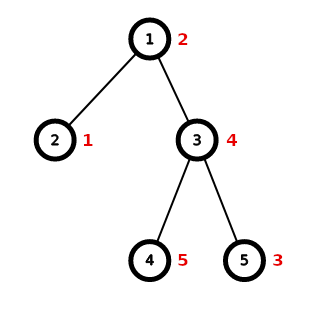
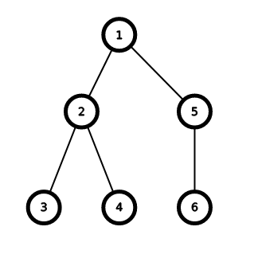
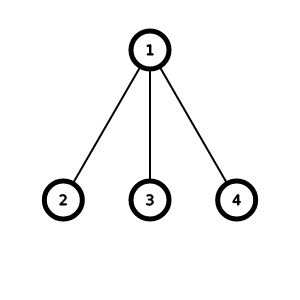

# E1. PermuTree (easy version)

**time limit per test:** 2 seconds

**memory limit per test:** 512 megabytes

**input:** standard input

**output:** standard output

This is the easy version of the problem. The differences between the two versions are the constraint on $n$ and the time limit. You can make hacks only if both versions of the problem are solved.

You are given a tree with $n$ vertices rooted at vertex $1$.

For some permutation$^\dagger$ $a$ of length $n$, let $f(a)$ be the number of pairs of vertices $(u, v)$ such that $a_u \lt a_{\operatorname{lca}(u, v)} \lt a_v$. Here, $\operatorname{lca}(u,v)$ denotes the [lowest common ancestor](<https://en.wikipedia.org/wiki/Lowest_common_ancestor>) of vertices $u$ and $v$.

Find the maximum possible value of $f(a)$ over all permutations $a$ of length $n$.

$^\dagger$ A permutation of length $n$ is an array consisting of $n$ distinct integers from $1$ to $n$ in arbitrary order. For example, $[2,3,1,5,4]$ is a permutation, but $[1,2,2]$ is not a permutation ($2$ appears twice in the array), and $[1,3,4]$ is also not a permutation ($n=3$ but there is $4$ in the array).

#### Input

The first line contains a single integer $n$ ($2 \le n \le 5000$).

The second line contains $n - 1$ integers $p_2,p_3,\ldots,p_n$ ($1 \le p_i \lt i$) indicating that there is an edge between vertices $i$ and $p_i$.

#### Output

Output the maximum value of $f(a)$.

#### Examples

#### Input
```
5
1 1 3 3
```

#### Output
```
4
```

#### Input
```
2
1
```

#### Output
```
0
```

#### Input
```
6
1 2 2 1 5
```

#### Output
```
7
```

#### Input
```
4
1 1 1
```

#### Output
```
2
```

#### Note

The tree in the first test:





One possible optimal permutation $a$ is $[2, 1, 4, 5, 3]$ with $4$ suitable pairs of vertices:

- $(2, 3)$, since $\operatorname{lca}(2, 3) = 1$ and $1 \lt 2 \lt 4$,
- $(2, 4)$, since $\operatorname{lca}(2, 4) = 1$ and $1 \lt 2 \lt 5$,
- $(2, 5)$, since $\operatorname{lca}(2, 5) = 1$ and $1 \lt 2 \lt 3$,
- $(5, 4)$, since $\operatorname{lca}(5, 4) = 3$ and $3 \lt 4 \lt 5$.

The tree in the third test:





The tree in the fourth test:



